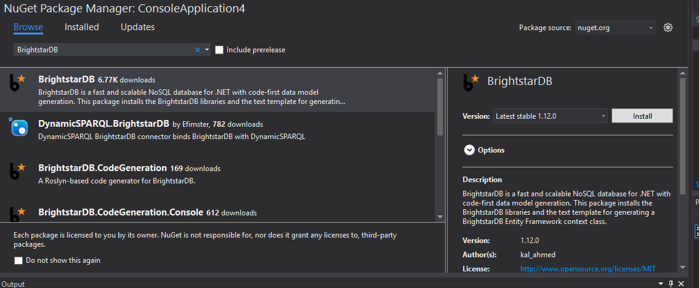

.. _Developer_Quick_Start:

**********************
 Developer Quick Start
**********************

BrightstarDB is about giving developers a really powerful, quick and clean experience in 
defining and realizing persistent object systems on .NET. To achieve this BrightstarDB can use 
a set of interface definitions with simple annotations to generate a full LINQ capable object 
model that stores object state in a BrightstarDB instance. In this quick introduction we will 
show how to create a new data model in Visual Studio, create a new BrightstarDB store and 
populate it with data. 

.. note::

  The source code for this example can be found in 
  [INSTALLDIR]\\Samples\\Embedded\\EntityFramework\\EntityFrameworkSamples.sln

Create New Project
==================

Create a new project in Visual Studio. For this example we chose a command line application. 
After creating the project ensure the build target is set to  '.NET Framework 4' or later (
do not select a Client Profile version of the .NET Framework) and that the 
Platform Target is set to 'Any CPU'

In the solution explorer, right click on the project icon and select 'Manage NuGet Packages...'
Set the Package source to 'nuget.org' and then use the search facility to search for BrightstarDB.
A number of packages will be displayed as shown in the screenshot below. Install the one named 'BrightstarDB'.

.. note::
  The version you install will probably differ from the one shown in the screenshot, however unless
  you are experimenting with new features from a beta release; or have a specific reason for sticking
  with an older release; we recommend that you always select the version labelled as 'Latest stable'.
  
The NuGet package and its dependencies will be automatically downloaded and added to your project.
The project will now show a new component has been added called 'MyEntityContext.tt'. This is
a T4 Text Template - a compile-time source code generator that will create the code framework
for you to query and updated BrightstarDB using LINQ.

.. note::
  When the T4 file is installed, Visual Studio may prompt you to confirm if you wish to run it with a dialog
  like the one shown below:
  
  .. image:: Images/getting-started-t4-template-confirmation.png

  Click OK to run the template (you can optionally check the 'Do not show this message again' which will prevent
  Visual Studio from popping up this dialog again).
  
It is also worth noting here that there is an alternate method for generating the code framework which will work
in Visual Studio 2015 and provides the possibility to use BrightstarDB's Entity Framework with Visual Basic. For
more information please refer to the section :ref:`Roslyn Code Generation <Roslyn_Code_Generation>`.

Create the Model
================

In this sample we will create a data model that contains actors and films. An actor has a name 
and a date of birth. An actor can star in many films and each film has many actors. Films also 
have name property.

The BrightstarDB Entity Framework requires you to define the data model as a set of .NET 
interface definitions.  Again, right-click on the solution item in the 
project explorer window and add a new item, this time from the displayed list choose 
Interface (under ``Visual C# Items > Code`` ) and change the name of the file to IActor.cs.

Add the following code to that file::

  [Entity]
  public interface IActor
  {
    string Name { get; set; }
    DateTime DateOfBirth { get; set; }  
    ICollection<IFilm> Films { get; set; }
  }

Then add another Interface file named IFilm.cs and include the following code::

  [Entity]
  public interface IFilm
  {
    string Name { get; set; }
	
    [InverseProperty("Films")]
    ICollection<IActor> Actors { get; }
  }

The ``[Entity]`` and ``[InverseProperty("Films")]`` decorators are instructions
to the BrightstarDB Entity Framework. The former indicates that this interface
defines an entity that should be included in the generated framework. The latter
specifies that the Actors property in the IFilm interface represents the inverse of the
relationship that the Films property in the IActor interface declares, so if an IFilm
is in the Films collection of an IActor instance, then that IActor instance will be found in the 
Actors collection of the IFilm instance. There are several other such decorators provided by 
BrightstarDB to give you more control over the generated entity framework code - these are 
described in much more detail in the :ref:`Entity Framework <Entity_Framework>` chapter of 
this documentation.

Generating the Context and Classes
==================================

A context is a manager for objects in a store. It provides an entry point for running LINQ 
queries and creating new objects. The context and implementing classes are automatically 
generated from the interface definitions. To create a context, right click on the 
MyEntityContext.tt file and select 'Run custom tool'. This updates the MyEntityContext.cs to 
contain the context class and also classes that implement the specified interfaces.

.. note::

  The context is not automatically rebuilt on every build. After making a change to the 
  interface definitions it is necessary to run the custom tool again.

Using the Context
=================

The context can be used inside any .NET application or web service. The commented code below 
shows how to initialize a context and then use that context to create and persist data. It 
concludes by showing how to query the database using LINQ::

  using System;
  using System.Collections.Generic;
  using System.Linq;
  using System.Text;
  using BrightstarDB.Client;

  namespace GettingStarted
  {
      class Program
      {
          static void Main(string[] args)
          {

              // define a connection string
              const string connectionString = "type=embedded;storesdirectory=.\\;storename=Films";

              // if the store does not exist it will be automatically 
              // created when a context is created
              var ctx = new MyEntityContext(connectionString);

              // create some films
              var bladeRunner = ctx.Films.Create();
              bladeRunner.Name = "BladeRunner";

              var starWars = ctx.Films.Create();
              starWars.Name = "Star Wars";

              // create some actors and connect them to films
              var ford = ctx.Actors.Create();
              ford.Name = "Harrison Ford";
              ford.DateOfBirth = new DateTime(1942, 7, 13);
              ford.Films.Add(starWars);
              ford.Films.Add(bladeRunner);

              var hamill = ctx.Actors.Create();
              hamill.Name = "Mark Hamill";
              hamill.DateOfBirth = new DateTime(1951, 9, 25);
              hamill.Films.Add(starWars);

              // save the data
              ctx.SaveChanges();

              // open a new context, not required
              ctx = new MyEntityContext(connectionString);

              // find an actor via LINQ
              ford = ctx.Actors.Where(a => a.Name.Equals("Harrison Ford")).FirstOrDefault();
              var dob = ford.DateOfBirth;

              // list his films
              var films = ford.Films;

              // get star wars
              var sw = films.Where(f => f.Name.Equals("Star Wars")).FirstOrDefault();

              // list actors in star wars
              foreach (var actor in sw.Actors)
              {
                  var actorName = actor.Name;
                  Console.WriteLine(actorName);
              }
              
              Console.ReadLine();
          }
      }
  }

Optimistic Locking
==================

Optimistic Locking is a way of handling concurrency control, meaning that multiple 
transactions can complete without affecting each other. If Optimistic Locking is turned on, 
then when a transaction tries to save data to the store, it first checks that the underlying 
data has not been modified by a different transaction. If it finds that the data has been 
modified, then the transaction will fail to complete.

BrightstarDB has the option to turn on optimistic locking when connecting to the store. This 
is done by setting the enableOptimisticLocking flag when opening a context such as below::

  ctx = new MyEntityContext(connectionString, true);
  var newFilm = ctx.Films.Create();
  ctx.SaveChanges();

  var newFilmId = newFilm.Id;

  //use optimistic locking when creating a new context
  var ctx1 = new MyEntityContext(connectionString, true);
  var ctx2 = new MyEntityContext(connectionString, true);

  //create a film in the first context
  var film1 = ctx1.Films.Where(f => f.Id.Equals(newFilmId)).FirstOrDefault();
  Console.WriteLine("First context has film with ID '{0}'", film1.Id);
  //create a film in the second context
  var film2 = ctx2.Films.Where(f => f.Id.Equals(newFilmId)).FirstOrDefault();
  Console.WriteLine("Second context has film with ID '{0}'", film2.Id);

  //attempt to change the data from both contexts
  film1.Name = "Raiders of the Lost Ark";
  film2.Name = "American Graffiti";

  //save the data to the store
  try
  {
    ctx1.SaveChanges();
    Console.WriteLine("Successfully updated the film to '{0}' in the store", film1.Name);
    ctx2.SaveChanges();
  }
  catch (Exception ex)
  {
  Console.WriteLine("Unable to save data to the store, as the underlying data has been modified.");
  }

  Console.ReadLine();

.. note::

  Optimistic Locking can also be enabled in the configuration using the 
  BrightstarDB.EnableOptimisticLocking application setting

Server Side Caching
===================

When enabled, query results are stored on disk until an update is made. If the same query is 
executed, the cached result is returned. Cached results are stored in the Windows temporary 
folder, and deleted when an update is made to the store.

Server side caching is enabled by default, but can be disabled by adding the appSetting below 
to the application configuration file::

      <add key="BrightstarDB.EnableServerSideCaching" value="false" />

.. note::
  Server side caching is not supported on BrightstarDB for Windows Phone 7.

What Next?
==========

While this is just a short introduction it has covered a lot of how BrightstarDB works. The 
following sections provide some more conceptual details on how the store works, more details 
on the Entity Framework and how to work with BrightstarDB as a triple store.
