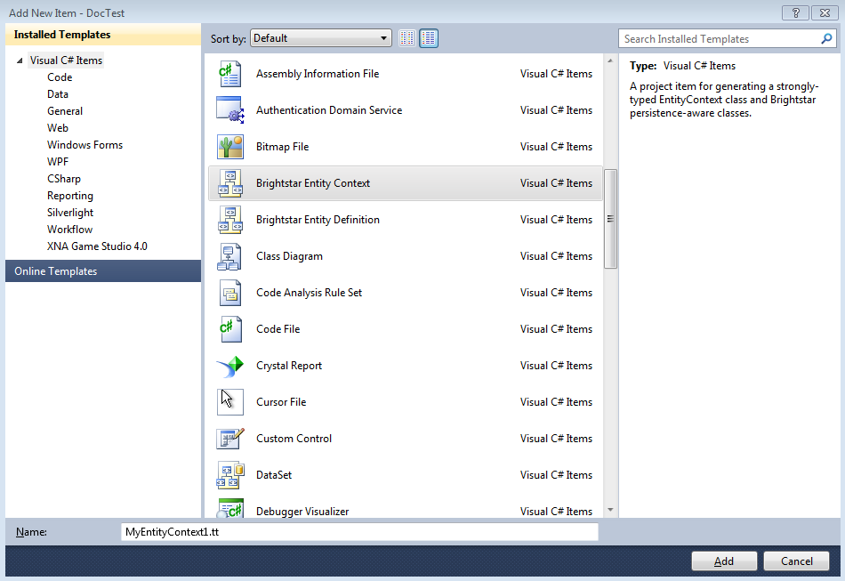
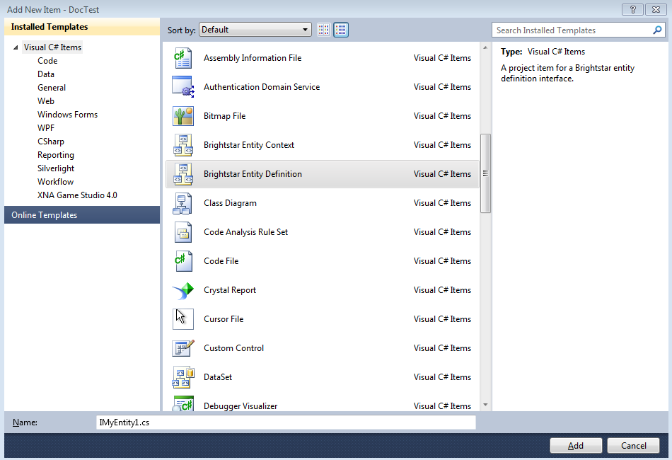

.. _Entity_Framework:

*****************
 Entity Framework
*****************

The BrightstarDB Entity Framework is the main way of working with BrightstarDB instances. For 
those of you wanting to work with the underlying RDF directly please see the section on 
:ref:`RDF Client API <RDF_Client_API>`. BrightstarDB allows developers to define a data model 
using .NET interface definitions. BrightstarDB tools introspect these definitions to create 
concrete classes that can be used to create, and update persistent data. If you haven't read 
the :ref:`Getting Started <Getting_Started>` section then we recommend that you do. The sample 
provided there covers most of what is required for creating most data models. The following 
sections in the developer guide provide more in-depth explanation of how things work along 
with more complex examples.

.. _Basics:

Basics
======

The BrightstarDB Entity Framework tooling is very simple to use. This guide shows how to get 
going, the rest of this section provides more in-depth information.

The process of using the Entity Framework is to:

  1. Include the BrightstarDB Entity Context item into a project.

  #. Define the interfaces for the data objects that should be persistent.

  #. Run the custom tool on the Entity Context text template file.

  #. Use the generated context to create, query or get and modify objects.

**Including the BrightstarDB Entity Context**

The **Brightstar Entity Context** is a text template that when run introspects the other 
code elements in the project and generates a number of classes and a context in a single file 
that can be found under the context file in Visual Studio. To add a new 
BrightstarEntityContext add a new item to the project. Locate the item in the list called 
Brightstar Entity Context, rename it if required, and add to the current project.

**Define Interfaces**

Interfaces are used to define a data model contract. Only interfaces marked with the ``Entity`` 
attribute will be processed by the text template. The following interfaces define a model that 
captures the idea of people working for an company.::

  [Entity]
  public interface IPerson
  {
      string Name { get; set; }
      DateTime DateOfBirth { get; set; }
      string CV { get; set; }
      ICompany Employer { get; set; }
  }

  [Entity]
  public interface ICompany
  {
      string Name { get; set; }
      [InverseProperty("Employer")]
      ICollection<IPerson> Employees { get; }
  }

**Including a Brightstar Entity Definition Item**

One quick way to include the outline of a BrightstarDB entity in a project is to right click 
on the project in the solution explorer and click **Add New Item**. Then select the 
**Brightstar Entity Definition** from the list and update the name.

This will add the following code file into the project.::

  [Entity]
  public interface IMyEntity1
  {
      /// 

      /// Get the persistent identifier for this entity
      /// 

      string Id { get; }

      // TODO: Add other property references here
  }

**Run the MyEntityContext.tt Custom Tool**

To ensure that the generated classes are up to date right click on the .tt file in the 
solution explorer and select **Run Custom Tool**. This will ensure that the all the 
annotated interfaces are turned into concrete classes.

.. note::

  The custom tool is not run automatically on every rebuild so after changing an interface 
  remember to run it.

**Using a Context**

A context can be thought of as a connection to a BrightstarDB instance. It provides access to 
the collections of domain objects defined by the interfaces. It also tracks all changes to 
objects and is responsible for executing queries and committing transactions.

A context can be opened with a connection string. If the store named does not exist it will be 
created. See the :ref:`connection strings <Connection_Strings>` section for more information 
on allowed configurations. The following code opens a new context connecting to an embedded 
store::

  var dataContext = new MyEntityContext("Type=embedded;StoresDirectory=c:\\brightstardb;StoreName=test");

The context exposes a collection for each entity type defined. For the types we defined above 
the following collections are exposed on a context::

  var people = dataContext.Persons;
  var companies = dataContext.Companies;

Each of these collections are in fact IQueryable and as such support LINQ queries over the 
model. To get an entity by a given property the following can be used::

  var brightstardb = dataContext.Companies.Where(
                         c => c.Name.Equals("BrightstarDB")).FirstOrDefault();

Once an entity has been retrieved it can be modified or related entities can be fetched::

  // fetching employees
  var employeesOfBrightstarDB = brightstardb.Employees;

  // update the company
  brightstardb.Name = "BrightstarDB";

New entities can be created either via the main collection; by using the ``new`` keyword 
and attaching the object to the context; or by passing the context into the constructor::

  // creating a new entity via the context collection
  var bob = dataContext.Persons.Create();
  bob.Name = "bob";

  // or created using new and attached to the context
  var bob = new Person() { Name = "Bob" };
  dataContext.Persons.Add(bob);

  // or created using new and passing the context into the constructor
  var bob = new Person(dataContext) { Name = "Bob" };

Once a new object has been created it can be used in relationships with other objects. The 
following adds a new person to the collection of employees. The same relationship could also 
have been created by setting the ``Employer`` property on the person::

  // Adding a new relationship between entities
  var bob = dataContext.Persons.Create();
  bob.Name = "bob";
  brightstardb.Employees.Add(bob);

  // The relationship can also be defined from the 'other side'.
  var bob = dataContext.Persons.Create();
  bob.Name = "bob";
  bob.Employer = brightstardb;

  // You can also create relationships to previously constructed
  // or retrieved objects in the constructor
  var brightstardb = new Company(dataContext) { Name = "BrightstarDB" };
  var bob = new Person(dataContext) { 
                    Name = "Bob; 
                    Employer = brightstardb 
            };

Saving the changes that have occurred is easily done by calling a method on the context::

  dataContext.SaveChanges();

.. _Annotations_Guide:

Annotations
===========

The BrightstarDB entity framework relies on a few annotation types in order to accurately 
express a data model. This section describes the different annotations and how they should be 
used. The only required attribute annotation is Entity. All other attributes give different 
levels of control over how the object model is mapped to RDF.

TypeIdentifierPrefix Attribute
------------------------------

BrightstarDB makes use of URIs to identify class types and property types. These URI values 
can be added on each property but to improve clarity and avoid mistakes it is possible to 
configure a base URI that is then used by all attributes. It is also possible to define models 
that do not have this attribute set.

The type identifier prefix can be set in the AssemblyInfo.cs file. The example below shows how 
to set this configuration property::

  [assembly: TypeIdentifierPrefix("http://www.mydomain.com/types/")]

Entity Attribute
----------------

The ``Entity`` attribute is used to indicate that the annotated interface should be included in 
the generated model. Optionally, a full URI or a URI postfix can be supplied that defines the 
identity of the class. The following examples show how to use the attribute. The example with 
just the value 'Person' uses a default prefix if one is not specified as described above::

  // example 1.
  [Entity] 
  public interface IPerson { ... }

  // example 2.
  [Entity("Person")] 
  public interface IPerson { ... }

  // example 3.
  [Entity("http://xmlns.com/foaf/0.1/Person")] 
  public interface IPerson { ... }

Example 3. above can be used to map .NET models onto existing RDF vocabularies. This allows 
the model to create data in a given vocabulary but it also allows models to be mapped onto 
existing RDF data.

.. _Identity_Property:

Identity Property
-----------------

The Identity property can be used to get and set the underlying identity of an Entity. 
The following example shows how this is defined::

  // example 1.
  [Entity("Person")] 
  public interface IPerson {
    string Id { get; }
  }

No annotation is required. It is also acceptable for the property to be called ``ID``, ``{Type}Id`` or 
``{Type}ID`` where ``{Type}`` is the name of the type. E.g: ``PersonId`` or ``PersonID``.

.. _Identifier_Attribute:

Identifier Attribute
--------------------

Id property values are URIs, but in some cases it is necessary to work with simpler string 
values such as GUIDs or numeric values. To do this the Id property can be decorated with the 
identifier attribute. The identifier attribute requires a string property that is the 
identifier prefix - this can be specified either as a URI string or as {prefix}:{rest of URI} 
where {prefix} is a namespace prefix defined by the Namespace Declaration Attribute (see below)::

  // example 1.
  [Entity("Person")] 
  public interface IPerson {
    [Identifier("http://www.mydomain.com/people/")]
    string Id { get; }
  }

  // example 2.
  [Entity]
  public interface ISkill {
    [Identifier("ex:skills#")]
    string Id {get;}
  }
  // NOTE: For the above to work there must be an assembly attribute declared like this:
  [assembly:NamespaceDeclaration("ex", "http://example.org/")]
  
The ``Identifier`` attribute has additional arguments that enable you to specify a (composite)
key for the type. For more information please refer to the section :ref:`Key_Properties_In_EF`.

From BrightstarDB release 1.9 it is possible to specify an empty string as the identifier prefix.
When this is done, the value assigned to the Id property MUST be a absolute URI as it is used
unaltered in the generated RDF triples. This gives your application complete control over the 
URIs used in the RDF data, but it also requires that your application manages the generation
of those URIs::

  [Entity]
  public interface ICompany {
    [Identifier("")]
    string Id {get;}
  }
  
**NOTE**: When using an empty string identifier prefix like this, the ``Create()`` method on the
context collection will automatically generate a URI with the prefix ``http://www.brightstardb.com/.well-known/genid/``.
To avoid this, you should instead create the entity directly using the constructor and
add it to the context. There are several ways in which this can be done::

    var co1 = context.Companies.Create();                           // This will get a BrightstarDB genid URI
    
    var co2 = new Company { Id = "http://contoso.com/" };           // Create an entity with the URI http://contoso.com
    context.Companies.Add(co2);                                     // ...then add it to the context
    
    var co3 = new Company(context) { Id = "http://example.com" };   // Create and add in a single line
    context.Companies.Add(
        new Company { Id = "http://networkedplanet.com" } );        // Alternate single-line approach

Property Inclusion
------------------

Any .NET property with a getter or setter is automatically included in the generated type, no 
attribute annotation is required for this::

  // example 1.
  [Entity("Person")] 
  public interface IPerson {
    string Id { get; }
    string Name { get; set; }
  }

Property Exclusion
------------------

If you want BrightstarDB to ignore a property you can simply decorate it with an ``[Ignore]``
attribute::

  [Entity("Person")]
  public interface IPerson {
    string Id {get; }
    string Name { get; set; }
    
    [Ignore]
    int Salary {get;}
  }

.. note::
  
  Properties that are ignored in this way are not implemented in the partial class that BrightstarDB
  generates, so you will need to ensure that they are implemented in a partial class that you create.

.. note::

  The ``[Ignore]`` attribute is not supported or required on *methods* defined in the interface as
  BrightstarDB does not implement interface methods - you are always required to provide method
  implementations in your own partial class.
  

Inverse Property Attribute
--------------------------

When two types reference each other via different properties that in fact reflect different 
sides of the same association then it is necessary to declare this explicitly. This can be 
done with the InverseProperty attribute. This attribute requires the name of the .NET property 
on the referencing type to be specified::

  // example 1.
  [Entity("Person")] 
  public interface IPerson {
    string Id { get; }
    ICompany Employer { get; set; }
  }

  [Entity("Company")] 
  public interface ICompany {
    string Id { get; }
    [InverseProperty("Employer")]
    ICollection<IPerson> Employees { get; set; }
  }

The above example shows that the inverse of ``Employees`` is ``Employer``. This means that if 
the ``Employer`` property on ``P1`` is set to ``C1`` then getting ``C1.Employees`` will 
return a collection containing ``P1``.

Namespace Declaration Attribute
-------------------------------

When using URIs in annotations it is cleaner if the complete URI doesn't need to be entered 
every time. To support this the NamespaceDeclaration assembly attribute can be used, many 
times if needed, to define namespace prefix mappings. The mapping takes a short string and the 
URI prefix to be used.

The attribute can be used to specify the prefixes required (typically assembly attributes are 
added to the AssemblyInfo.cs code file in the Properties folder of the project)::

  [assembly: NamespaceDeclaration("foaf", "http://xmlns.com/foaf/0.1/")]

Then these prefixes can be used in property or type annotation using the CURIE syntax of 
{prefix}:{rest of URI}::

  [Entity("foaf:Person")]
  public interface IPerson  { ... }

Namespace declarations defined in this way can also be retrieved programatically. The class
``BrightstarDB.EntityFramework.NamespaceDeclarations`` provides methods for retrieving 
these declarations in a variety of formats::

    // You can just iterate them as instances of 
    // BrightstarDB.EntityFramework.NamespaceDeclarationAttribute
    foreach(var nsDecl in NamespaceDeclarations.ForAssembly(Assembly.GetExecutingAssembly()))
    {
        // prefix is in nsDecl.Prefix
        // Namespace URI is in nsDecl.Reference
    }
    
    // Or you can retrieve them as a dictionary:
    var dict = NamespaceDeclarations.ForAssembly(Assembly.GetExecutingAssembly());
    foafUri = dict["foaf"];
    
    // You can omit the Assembly parameter if you are calling from the assembly
    // containing the delcarations.
    
    // You can get the declarations formatted for use in SPARQL...
    // e.g. PREFIX foaf: <http://xmlns.com/foaf/0.1/>
    sparqlPrefixes = NamespaceDeclarations.ForAssembly().AsSparql();
    
    // ...or for use in Turtle (or TRiG)
    // e.g. @prefix foaf: <http://xmlns.com/foaf/0.1/> .
    turtlePrefixes = NamespaceDeclarations.ForAssembly().AsTurtle();
    

Property Type Attribute
-----------------------

While no decoration is required to include a property in a generated class, if the property is 
to be mapped onto an existing RDF vocabulary then the PropertyType attribute can be used to do 
this. The PropertyType attribute requires a string property that is either an absolute or 
relative URI. If it is a relative URI then it is appended to the URI defined by the 
TypeIdentifierPrefix attribute or the default base type URI. Again, prefixes defined by a 
NamespaceDeclaration attribute can also be used::

  // Example 1. Explicit type declaration
  [PropertyType("http://www.mydomain.com/types/name")]
  string Name { get; set; }

  // Example 2. Prefixed type declaration. 
  // The prefix must be declared with a NamespaceDeclaration attribute
  [PropertyType("foaf:name")]
  string Name { get; set; }

  // Example 3. Where "name" is appended to the default namespace 
  // or the one specified by the TypeIdentifierPrefix in AssemblyInfo.cs.
  [PropertyType("name")]
  string Name { get; set; }

Inverse Property Type Attribute
-------------------------------

Allows inverse properties to be mapped to a given RDF predicate type rather than a .NET 
property name. This is most useful when mapping existing RDF schemas to support the case where 
the .NET data-binding only requires the inverse of the RDF property::

  // Example 1. The following states that the collection of employees 
  // is found by traversing the "http://www.mydomain.com/types/employer"
  // predicate from instances of Person.
  [InversePropertyType("http://www.mydomain.com/types/employer")]
  ICollection<IPerson> Employees { get; set; }

Additional Custom Attributes
----------------------------

Any custom attributes added to the entity interface that are not in the 
BrightstarDB.EntityFramework namespace will be automatically copied through into the generated 
class. This allows you to easily make use of custom attributes for validation, property 
annotation and other purposes. 

As an example, the following interface code::

  [Entity("http://xmlns.com/foaf/0.1/Person")]
  public interface IFoafPerson : IFoafAgent
  {
      [Identifier("http://www.networkedplanet.com/people/")]
      string Id { get; }

      [PropertyType("http://xmlns.com/foaf/0.1/nick")]
      [DisplayName("Also Known As")]
      string Nickname { get; set; }

      [PropertyType("http://xmlns.com/foaf/0.1/name")]
      [Required]
      [CustomValidation(typeof(MyCustomValidator), "ValidateName", 
                        ErrorMessage="Custom error message")]
      string Name { get; set; }
  }

would result in this generated class code::

      public partial class FoafPerson : BrightstarEntityObject, IFoafPerson 
      {
      public FoafPerson(BrightstarEntityContext context, IDataObject dataObject) : base(context, dataObject) { }
      public FoafPerson() : base() { }
      public System.String Id { get {return GetIdentity(); } set { SetIdentity(value); } }
      #region Implementation of BrightstarDB.Tests.EntityFramework.IFoafPerson
      
      [System.ComponentModel.DisplayNameAttribute("Also Known As")]
      public System.String Nickname
      {
              get { return GetRelatedProperty<System.String>("Nickname"); }
              set { SetRelatedProperty("Nickname", value); }
      }
      
      [System.ComponentModel.DataAnnotations.RequiredAttribute]    
      [System.ComponentModel.DataAnnotations.CustomValidationAttribute(typeof(MyCustomValidator), 
        "ValidateName", ErrorMessage="Custom error message")]
      public System.String Name
      {
              get { return GetRelatedProperty<System.String>("Name"); }
              set { SetRelatedProperty("Name", value); }
      }
      
     #endregion
      }

It is also possible to add custom attributes to the generated entity class itself. Any custom 
attributes that are allowed on both classes and interfaces can be added to the entity 
interface and will be automatically copied through to the generated class in the same was as 
custom attributes on properties. However, if you need to use a custom attribute that is 
allowed on a class but not on an interface, then you must use the 
BrightstarDB.EntityFramework.ClassAttribute attribute. This custom attribute can be added to 
the entity interface and allows you to specify a different custom attribute that should be 
added to the generated entity class. When using this custom attribute you should ensure that 
you either import the namespace that contains the other custom attribute or reference the 
other custom attribute using its fully-qualified type name to ensure that the generated class 
code compiles successfully.

For example, the following interface code::

  [Entity("http://xmlns.com/foaf/0.1/Person")]
  [ClassAttribute("[System.ComponentModel.DisplayName(\\"Person\\")]")]
  public interface IFoafPerson : IFoafAgent
  {
    // ... interface definition here
  }

would result in this generated class code::

  [System.ComponentModel.DisplayName("Person")]
  public partial class FoafPerson : BrightstarEntityObject, IFoafPerson 
  {
    // ... generated class code here
  }

Note that the DisplayName custom attribute is referenced using its fully-qualified type name 
(``System.ComponentModel.DisplayName``), as the generated context code will not include a 
``using System.ComponentModel;`` namespace import. Alternatively, this interface code would also 
generate class code that compiles correctly::

  using System.ComponentModel;

  [Entity("http://xmlns.com/foaf/0.1/Person")]
  [ClassAttribute("[DisplayName(\\"Person\\")]")]
  public interface IFoafPerson : IFoafAgent
  {
    // ... interface definition here
  }

.. _Patterns:

Patterns
========

This section describes how to model common patterns using BrightstarDB Entity Framework. It 
covers how to define one-to-one, one-to-many, many-to-many and reflexive relationships.

Examples of these relationship patterns can be found in the :ref:`Tweetbox sample <Tweetbox>`.

One-to-One
----------

Entities can have one-to-one relationships with other entities. An example of this would be 
the link between a user and a the authorization to another social networking site. The 
one-to-one relationship would be described in the interfaces as follows::

  [Entity]
  public interface IUser {
    ...
    ISocialNetworkAccount SocialNetworkAccount { get; set; }
    ...
  }

  [Entity]
  public interface ISocialNetworkAccount {
    ...
    [InverseProperty("SocialNetworkAccount")]
            IUser TwitterAccount { get; set; }
    ...
  }

One-to-Many
-----------

A User entity can be modeled to have a one-to-many relationship with a set of Tweet entities, 
by marking the properties in each interface as follows::

  [Entity]
  public interface ITweet {
    ...
    IUser Author { get; set; }
    ...
  }
  
  [Entity]
  public interface IUser {
    ...
    [InverseProperty("Author")]
    ICollection<ITweet> Tweets { get; set; }
    ...
  }

Many-to-Many
------------

The Tweet entity can be modeled to have a set of zero or more Hash Tags. As any Hash Tag 
entity could be used in more than one Tweet, this uses a many-to-many relationship pattern::

  [Entity]
  public interface ITweet {
    ...
    ICollection<IHashTag> HashTags { get; set; }
    ...
  }

  [Entity]
  public interface IHashTag {
    ...
    [InverseProperty("HashTags")]
    ICollection<ITweet> Tweets { get; set; }
    ...
  }

Reflexive relationship
----------------------

A reflexive relationship (that refers to itself) can be defined as in the example below::

  [Entity]
  public interface IUser {
    ...
    ICollection<IUser> Following { get; set; }

    [InverseProperty("Following")]
    ICollection<IUser> Followers { get; set; }
    ...
  }

.. _Behaviour:

Behaviour
=========

The classes generated by the BrightstarDB Entity Framework deal with data and data 
persistence. However, most applications require these classes to have behaviour. All generated 
classes are generated as .NET partial classes. This means that another file can contain 
additional method definitions. The following example shows how to add additional methods to a 
generated class.

Assume we have the following interface definition::

  [Entity]
  public interface IPerson {
    string Id { get; }
    string FirstName { get; set; }
    string LastName { get; set; }  
  }

To add custom behaviour the new method signature should first be added to the interface. The 
example below shows the same interface but with an added method signature to get a user's full 
name::

  [Entity]
  public interface IPerson {
    string Id { get; }
    string FirstName { get; set; }
    string LastName { get; set; }
    // new method signature
    string GetFullName();  
  }

After running the custom tool on the EntityContext.tt file there is a new class called Person. 
To add additional methods add a new .cs file to the project and add the following class 
declaration::

  public partial class Person {
    public string GetFullName() {
      return FirstName + " " + LastName;
    }
  }

The new partial class implements the additional method declaration and has access to all the 
data properties in the generated class.  

.. _Key_Properties_in_EF:

Key Properties and Composite Keys
=================================

The :ref:`Identity_Property` provides a simple means of accessing the key value of an entity,
this key value is concatenated with the base URI string for the entity type to generate the full
URI identifier of the RDF resource that is created for the entity. In many applications the exact
key used is immaterial, and the default strategy of generating a GUID-based key works well. However
in some cases it is desirable to have more control over the key assigned to an entity. For this
purpose we provide a number of additional arguments on the ``Identifier`` attribute. These arguments
allow you to specify that the key for an entity type is generated from one or more of its properties

Specifying Key Properties
-------------------------

The ``KeyProperties`` argument accepts an array of strings that name
the properties of the entity that should be combined to create a key value for the entity.
The value of the named properties will be concatenated in the order that they are named
in the ``KeyProperties`` array, with a slash ('/') between values::

    // An entity with a key generated from one of its properties.
    [Entity]
    public interface IBook {
        [Identifier("http://example.org/books/", 
                    KeyProperties=new [] {"Isbn"}]
        public string Id { get; }
        public string Isbn {get;set;}
    }
    
    // An entity with a composite key
    [Entity]
    public interface IWidget {
        [Identifier("http://widgets.org/", 
            KeyProperties=new [] {"Manufacturer", "ProductCode"}]
        public string Id { get; }
        public string Manufacturer {get;set;}
        public string ProductCode  {get;set;}
    }

    // In use...
    var book = context.Books.Create();
    book.Isbn = "1234567890";
    // book URI identifier will be http://example.org/books/1234567890
    
    var widget = context.Widgets.Create();
    widget.Manufacturer = "Acme";
    widget.ProductCode = "Grommet"
    // widget identifier will be http://widgets.org/Acme/Grommet
    
Key Separator
-------------

The ``KeySeparator`` argument of the ``Identifier`` attribute allows you to change the string
used to concatenate multiple values into a single key::

    // An entity with a composite key
    [Entity]
    public interface IWidget {
        [Identifier("http://widgets.org/", 
            KeyProperties=new [] {"Manufacturer", "ProductCode"},
            KeySeparator="_"]
        public string Id { get; }
        public string Manufacturer {get;set;}
        public string ProductCode  {get;set;}
    }

    var widget = context.Widgets.Create();
    widget.Manufacturer = "Acme";
    widget.ProductCode = "Grommet"
    // widget identifier will be http://widgets.org/Acme_Grommet
    
Key Converter
-------------

The values of the key properties are converted to a string by a class that implements the
``BrightstarDB.EntityFramework.IKeyConverter`` interface. The default implementation implements
the following rules:

    * Integer and decimal values are converted using the InvariantCulture (to eliminate culture-specific separators)
    * Properties whose value is another entity will yield the key of that entity. That is the 
      part of the URI identifier that follows the base URI string.
    * Properties whose value is NULL are ignored.
    * If all key properties are NULL, a NULL key will be generated, which will result in a 
      ``BrightstarDB.EntityFramework.EntityKeyRequiredException`` being raised.
    * The converted string value is URI-escaped using the .NET method ``Uri.EscapeUriString(string)``.
    * Multiple non-null values are concatenated using the separator specified by the KeySeparator property.

You can create your own key conversion rules by implementing the ``IKeyConverter`` interface and specifying
the implementation type in the ``KeyConverterType`` argument of the ``Identifier`` attribute.

Hierarchical Key Pattern
------------------------

Using the default key conversion rules it is possible to construct hierarchical identifier schemes::

    [Entity]
    public interface IHierarchicalKeyEntity
    {
        [Identifier(BaseAddress = "http://example.org/", 
         KeyProperties = new[]{"Parent", "Code"})]
        string Id { get; }

        IHierarchicalKeyEntity Parent { get; set; }
        string Code { get; set; }
    }

    // Example:
    var parent = context.HierarchicalKeyEntities.Create();
    parent.Code = "parent"; // URI will be http://example.org/parent
    
    var child = context.HierarchicalKeyEntities.Create();
    child.Parent = parent;
    child.Code = "child"; // URI will be http://example.org/parent/child
    
.. note::
    Although this example uses the same type of entity for both parent and child
    object, it is equally valid to use different types of entity for parent and child.
    
.. _Key_Constraints:

Key Constraints
---------------

When using the Entity Framework with the BrightstarDB back-end, entities with key properties 
are treated as having a "class-unique key constraint". This means that it is not allowed to
create an RDF resource with the same URI identifier and the same RDF type. This form of
constraint means that it is possible for one resource to have multiple types, but it still
ensures that for any given type all of its identifiers are unique.

The constraint is checked as part of the update transaction and if it fails a ``BrightstarDB.EntityFramework.UniqueConstraintViolationException``
will be raised. The constraint is also checked when creating new entities, but in this case
the check is only against the entities currently loaded into the context - this allows your
code to "fail fast" if a uniqueness violation occurs in the collection of entities loaded
in the context.

.. warning::
    Key constraints are not checked when using the Entity Framework with a DotNetRDF or
    generic SPARQL back-end, as the SPARQL UPDATE protocol does not allow for such transaction
    pre-conditions to be checked.

Changing Identifiers
--------------------

With release 1.7 of BrightstarDB, it is now possible to alter the URI identifier of 
an entity. Currently this is only supported on entities that have generated keys and
is achieved by modifying any of the properties that contribute to the key.

A change of identifier is handled by the Entity Framework as a deletion of all triples
where the old identifier is the subject or object of the triple, followed by the creation
of a new set of triples equivalent to the deleted set but with the old identifier replaced
by the new identifier. Because the triples where the identifier is used as the object
are updated, all "links" in the data set will be properly maintained when an identifier
is modified in this way.

.. warning::
    When using another entity ID as part of the composite key for an entity please
    be aware that currently the entity framework code does not automatically change
    the identifiers of all dependencies when a dependent ID property is changed. This
    is done to avoid a large amount of overhead in checking for ID dependencies in the
    data store when changes are saved. The supported use case is that the dependency ID
    (e.g. the ID of the parent entity) is not modified once it is used to construct other
    identifiers.
    
    
.. _Optimistic_Locking_in_EF:

Optimistic Locking
==================

The Entity Framework provides the option to enable optimistic locking when working with the 
store. Optimistic locking uses a well-known version number property (the property predicate 
URI is http://www.brightstardb.com/.well-known/model/version) to track the version number of 
an entity, when making an update to an entity the version number is used to determine if 
another client has concurrently updated the entity. If this is detected, it results in an 
exception of the type ``BrightstarDB.Client.TransactionPreconditionsFailedException`` being raised.

Enabling Optimistic Locking
---------------------------

Optimistic locking can be enabled either through the connection string (giving the user 
control over whether or not optimistic locking is enabled) or through code (giving the control 
to the programmer). 

To enable optimistic locking in a connection string, simply add "optimisticLocking=true" to 
the connection string. e.g. ::

  type=rest;endpoint=http://localhost:8090/brightstar;storeName=myStore;optimisticLocking=true

To enable optimistic locking from code, use the optional optimisticLocking parameter on the 
constructor of the context class e.g.::

  var myContext = new MyEntityContext(connectionString, true);

.. note::

  The programmatic setting always overrides the setting in the connection string - this gives 
  the programmer final control over whether optimistic locking is used. The programmer can 
  also prevent optimistic locking from being used by passing false as the value of the 
  ``optimisticLocking`` parameter of the constructor of the context class.

Handling Optimistic Locking Errors
----------------------------------

Optimistic locking errors only occur when the ``SaveChanges()`` method is called on the context 
class. The error is notified by raising an exception of the type 
``BrightstarDB.Client.TransactionPreconditionsFailedException``. When this exception is caught by 
your code, you have two basic options to choose from. You can apply each of these options 
separately to each object modified by your update.

  1. Attempt the save again but first update the local context object with data from the 
     server. This will save all the changes you have made EXCEPT for those that were detected on 
     the server. This is the "store wins" scenario.

  #. Attempt the save again, but first update only the version numbers of the local context 
     object with data from the server. This will keep all the changes you have made, overwriting 
     any concurrent changes that happened on the server. This is the "client wins" scenario.

To attempt the save again, you must first call the ``Refresh()`` method on the context object. 
This method takes two paramters - the first parameter specifies the mode for the refresh, this 
can either be RefreshMode.ClientWins or RefreshMode.StoreWins depending on the scenario to be 
applied. The second parameter is the entity or collection of entities to which the refresh is 
to be applied. You apply different refresh strategies to different entities within the same 
update if you wish. Once the conflicted entities are refreshed, you can then make a call to 
the ``SaveChanges()`` method of the context once more. The code sample below shows this in 
outline::

  try 
  {
    myContext.SaveChanges();
  }
  catch(TransactionPreconditionsFailedException) 
  {
    // Refresh the conflicted object(s) - in this case with the StoreWins mode
    myContext.Refresh(RefreshMode.StoreWins, conflictedEntity);
    // Attempt the save again
    myContext.SaveChanges();
  }

.. note::

  On stores with a high degree of concurrent updates it is possible that the second call to 
  ``SaveChanges()`` could also result in an optimistic locking error because objects have been 
  further modified since the initial optimistic locking failure was reported. Production code 
  for highly concurrent environments should be written to handle this possibility.

.. _LINQ_Restrictions:

LINQ Restrictions
=================

Supported LINQ Operators
------------------------

The LINQ query processor in BrightstarDB has some restrictions, but supports the most commonly 
used core set of LINQ query methods. The following table lists the supported query methods. 
Unless otherwise noted the indexed variant of LINQ query methods are not supported.

=================  =====
Method             Notes  
=================  =====
Any                Supported as first result operator. Not supported as second or subsequent result operator  
All                Supported as first result operator. Not supported as second or subsequent result operator  
Average            Supported as first result operator. Not supported as second or subsequent result operator.  
Cast               Supported for casting between Entity Framework entity types only  
Contains           Supported for literal values only  
Count              Supported with or without a Boolean filter expression. Supported as first result operator. Not supported as second or subsequent result operator.  
Distinct           Supported for literal values. For entities ``Distinct()`` is supported but only to eliminate duplicates of the same Id any override of .Equals on the entity class is not used.  
First              Supported with or without a Boolean filter expression  
LongCount          Supported with or without a Boolean filter expression. Supported as first result operator. Not supported as second or subsequent result operator.  
Max                Supported as first result operator. Not supported as second or subsequent result operator.  
Min                Supported as first result operator. Not supported as second or subsequent result operator.  
OfType<TResult>    Supported only if ``TResult`` is an Entity Framework entity type
OrderBy    
OrderByDescending    
Select    
SelectMany    
Single             Supported with or without a Boolean filter expression  
SingleOrDefault    Supported with or without a Boolean filter expression  
Skip    
Sum                Supported as first result operator. Not supported as second or subsequent result operator.  
Take    
ThenBy    
ThenByDescending    
Where    
=================  =====

Supported Class Methods and Properties
--------------------------------------

In general, the translation of LINQ to SPARQL cannot translate methods on .NET datatypes into 
functionally equivalent SPARQL. However we have implemented translation of a few commonly used 
String, Math and DateTime methods as listed in the following table.

The return values of these methods and properties can only be used in the filtering of queries 
and cannot be used to modify the return value. For example you can test that 
``foo.Name.ToLower().Equals("somestring")``, but you cannot return the value ``foo.Name.ToLower()``.

+-----------------------------------------+--------------------------------------------------+
| .NET function                           | SPARQL Equivalent                                |
+=========================================+==================================================+
|                                 **String Functions**                                       |
+-----------------------------------------+--------------------------------------------------+
|p0.StartsWith(string s)                  |  STRSTARTS(p0, s)                                |
+-----------------------------------------+--------------------------------------------------+
| p0.StartsWith(string s, bool ignoreCase,| REGEX(p0, "^" + s, "i") if ignoreCase is true;   |
| CultureInfo culture)                    | STRSTARTS(p0, s) if ignoreCase is false          |
+-----------------------------------------+--------------------------------------------------+
| p0.StartsWith(string s,                 | REGEX(p0, "^" + s, "i") if comparisonOptions is  |
| StringComparison comparisonOptions)     | StringComparison.CurrentCultureIgnoreCase,       |
|                                         | StringComparison.InvariantCultureIgnoreCase or   |
|                                         | StringComparison.OrdinalIgnoreCase;              |
|                                         | STRSTARTS(p0, s) otherwise                       |
+-----------------------------------------+--------------------------------------------------+
| p0.EndsWith(string s)                   | STRENDS(p0, s)                                   |
+-----------------------------------------+--------------------------------------------------+
| p0.StartsWith(string s, bool ignoreCase,| REGEX(p0, s + "$", "i") if ignoreCase is true;   |
|  CultureInfo culture)                   | STRENDS(p0, s) if ignoreCase is false            |
+-----------------------------------------+--------------------------------------------------+
| p0.StartsWith(string s, StringComparison| REGEX(p0, s + "$", "i") if comparisonOptions is  |
|  comparisonOptions)                     | StringComparison.CurrentCultureIgnoreCase,       |
|                                         | StringComparison.InvariantCultureIgnoreCase or   |
|                                         | StringComparison.OrdinalIgnoreCase;              |
|                                         | STRENDS(p0, s) otherwise                         |
+-----------------------------------------+--------------------------------------------------+
| p0.Length                               | STRLEN(p0)                                       |
+-----------------------------------------+--------------------------------------------------+
| p0.Substring(int start)                 | SUBSTR(p0, start)                                |
+-----------------------------------------+--------------------------------------------------+
| p0.Substring(int start, int len)        | SUBSTR(p0, start, end)                           |
+-----------------------------------------+--------------------------------------------------+
| p0.ToUpper()                            | UCASE(p0)                                        |
+-----------------------------------------+--------------------------------------------------+
| p0.ToLower()                            | LCASE(p0)                                        |
+-----------------------------------------+--------------------------------------------------+
|                                   **Date Functions**                                       |
+-----------------------------------------+--------------------------------------------------+
| p0.Day                                  | DAY(p0)                                          |
+-----------------------------------------+--------------------------------------------------+
| p0.Hour                                 | HOURS(p0)                                        |
+-----------------------------------------+--------------------------------------------------+
| p0.Minute                               | MINUTES(p0)                                      |
+-----------------------------------------+--------------------------------------------------+
| p0.Month                                | MONTH(p0)                                        |
+-----------------------------------------+--------------------------------------------------+
| p0.Second                               | SECONDS(p0)                                      |
+-----------------------------------------+--------------------------------------------------+
| p0.Year                                 | YEAR(p0)                                         |
+-----------------------------------------+--------------------------------------------------+
|                                  **Math Functions**                                        |    
+-----------------------------------------+--------------------------------------------------+
| Math.Round(decimal d)                   | ROUND(d)                                         |
+-----------------------------------------+--------------------------------------------------+
| Math.Round(double d)                    | ROUND(d)                                         |
+-----------------------------------------+--------------------------------------------------+
| Math.Floor(decimal d)                   | FLOOR(d)                                         |
+-----------------------------------------+--------------------------------------------------+
| Math.Floor(double d)                    | FLOOR(d)                                         |
+-----------------------------------------+--------------------------------------------------+
| Math.Ceiling(decimal d)                 | CEIL(d)                                          |
+-----------------------------------------+--------------------------------------------------+
| Math.Ceiling(decimal d)                 | CEIL(d)                                          |
+-----------------------------------------+--------------------------------------------------+
|                                **Regular Expressions**                                     |
+-----------------------------------------+--------------------------------------------------+
| Regex.IsMatch(string p0,                | REGEX(p0, expression, flags)                     |
|  string expression,                     | Flags are generated from the options parameter.  |
|  RegexOptions options)                  | The supported RegexOptions are IgnoreCase,       |
|                                         | Multiline, Singleline and                        |
|                                         | IgnorePatternWhitespace (or any combination of   |
|                                         | these).                                          |
+-----------------------------------------+--------------------------------------------------+

The static method ``Regex.IsMatch()`` is supported when used to filter on a string property 
in a LINQ query e.g.::

  context.Persons.Where(p => Regex.IsMatch(p.Name, "^a.*e$", RegexOptions.IgnoreCase));

However, please note that the regular expression options that can be used is limited to a 
combination of ``IgnoreCase``, ``Multiline``, ``Singleline`` and ``IgnorePatternWhitespace``.

.. _Casting:

Casting Entities
================

One of the nicest features of RDF is its flexibility - an RDF resource can be of multiple types and
can support multiple (possibly conflicting) properties according to different schemas. It allows you
to record different aspects of the same thing all at a single point in the data store. In OO programming
however, we tend to prefer to separate out different representations of the same thing into different classes
and to use those classes to encapsulate a specific model. So there is a tension between the freedom in 
RDF to record anything about any resource and the need in traditional OO programming to have a set of
types and properties defined at compile time.

In BrightstarDB the way we handle is is to allow you to convert an entity from one type to any other 
entity type at runtime. This feature is provided by the ``Become<T>()`` method on the entity object.
Calling ``Become<T>()`` on an entity has two effects:

  1.  It adds one or more RDF type statements to the resource so that it is now recorded as being an
      instance of the RDF class that the entity type ``T`` is mapped to. When ``T`` inherits from a base entity
      type both the RDF type for ``T`` and the RDF type for the base type is added.
  2.  It returns an instance of ``T`` which is bound to the same underlying DataObject as the entity you
      call ``Become<T>()`` on.

This feature gives you the ability to convert and extend resources at runtime with almost no overhead.
You should note that ``Become<T>()`` does nothing to ensure that the resource conforms to the constraints
that the type ``T`` might imply, so your code should be written to robustly handle missing properties.

Once you call ``SaveChanges()`` on the context, the new type statements (and any new properties you created)
are committed to the store. You will now find the object can be accessed through the context entity set for
``T``.

There is also an ``Unbecome<T>()`` method. This method can be used to remove RDF type statements from an 
entity so that it no longer appears in the collection of entities of type ``T`` on  the context. Note that
this does not remove the RDF type statements for super-types of ``T``, but you can explicitly do this by 
making further calls to ``Unbecome<T>()`` with the appropriate super-types.

.. _OData:

OData
=====

The Open Data Protocol (OData) is an open web protocol for querying data. An OData provider can be added to BrightstarDB Entity Framework projects to allow OData 
consumers to query the underlying data in the store. 

.. note::

  :ref:`Identifier Attributes <Annotations_Guide>` must exist on any BrightstarDB entity 
  interfaces in order to be processed by an OData consumer

For more details on how to add a BrightstarDB OData service to your projects, read 
:ref:`Adding Linked Data Support <Adding_Linked_Data_Support>` in the MVC Nerd Dinner samples 
chapter 

OData Restrictions
------------------

The OData v2 protocol implemented by BrightstarDB does not support properties that contain a 
collection of literal values. This means that BrightstarDB entity properties that are of type 
``ICollection<literal type>`` are not supported. Any properties of this type will not be 
readable via the OData service.

An OData provider connected to the BrightstarDB Entity Framework as a few restrictions on how 
it can be queried.

**Expand**

  - Second degree expansions are not currently supported. e.g. 
    ``Department('5598556a-671a-44f0-b176-502da62b3b2f')?$expand=Persons/Skills``

**Filtering**

  - The arithmetic filter ``Mod`` is not supported

  - The string filter functions ``int indexof(string p0, string p1)``, 
    ``string trim(string p0)`` and ``trim(string p0, string p1)`` are not supported.

  - The type filter functions ``bool IsOf(type p0)`` and ``bool IsOf(expression p0, type p1)`` 
    are not supported.

**Format**

Microsoft WCF Data Services do not currently support the ``$format`` query option. 
To return OData results formatted in JSON, the accept headers can be set in the web request 
sent to the OData service.

.. _SavingChanges_Event:

SavingChanges Event
===================

The generated EntityFramework context class exposes an event, ``SavingChanges``. This event is 
raised during the processing of the ``SaveChanges()`` method before any data is committed back to 
the Brightstar store. The event sender is the context class itself and in the event handler 
you can use the ``TrackedObjects`` property of the context class to iterate through all entities 
that the context class has retrieved from the BrightstarDB store. Entities expose an ``IsModified`` 
property which can be used to determine if the entity has been newly created or locally 
modified. The sample code below uses this to update a ``Created`` and ``LastModified`` 
timestamp on any entity that implements the ``ITrackable`` interface.::

  private static void UpdateTrackables(object sender, EventArgs e)
  {
    // This method is invoked by the context.
    // The sender object is the context itself
    var context = sender as MyEntityContext;

    // Iterate through just the tracked objects that implement the ITrackable interface
    foreach(var t in context.TrackedObjects
                    .Where(x=>x is ITrackable && x.IsModified)
                    .Cast<ITrackable>())
    {
      // If the Created property is not yet set, it will have DateTime.MinValue as its defaulft value
      // We can use this fact to determine if the Created property needs setting.
      if (t.Created == DateTime.MinValue) t.Created = DateTime.Now;

      // The LastModified property should always be updated
      t.LastModified = DateTime.Now;
    }
  }

.. note::

  The source code for this example can be found in [INSTALLDIR]\\Samples\\EntityFramework\\EntityFrameworkSamples.sln

.. _Local_Change_Tracking:

INotifyPropertyChanged and INotifyCollectionChanged Support
===========================================================

.. _System.ComponentModel.INotifyPropertyChanged: http://msdn.microsoft.com/en-us/library/system.componentmodel.inotifypropertychanged%28v=vs.100%29.aspx
.. _System.Collections.Specialized.INotifyCollectionChanged: http://msdn.microsoft.com/en-us/library/system.collections.specialized.inotifycollectionchanged%28v=vs.100%29.aspx
.. _CollectionChanged: http://msdn.microsoft.com/en-us/library/system.collections.specialized.inotifycollectionchanged.collectionchanged%28v=vs.100%29.aspx
.. _NotifyCollectionChangedAction.Reset: http://msdn.microsoft.com/en-us/library/system.collections.specialized.notifycollectionchangedaction%28v=vs.100%29.aspx
.. _NotifyCollectionChangedAction.Remove: http://msdn.microsoft.com/en-us/library/system.collections.specialized.notifycollectionchangedaction%28v=vs.100%29.aspx

The classes generated by the Entity Framework provide support for tracking local changes. All 
generated entity classes implement the `System.ComponentModel.INotifyPropertyChanged`_ 
interface and fire a notification event any time a property with a single value is modified. 
All collections exposed by the generated classes implement the 
`System.Collections.Specialized.INotifyCollectionChanged`_ interface and fire a notification 
when an item is added to or removed from the collection or when the collection is reset.

There are a few points to note about using these features with the Entity Framework:

Firstly, although the generated classes implement the ``INotifyPropertyChanged`` interface, your 
code will typically use the interfaces. To attach a handler to the ``PropertyChanged`` event, you 
need an instance of ``INotifyPropertyChanged`` in your code. There are two ways to achieve this - 
either by casting or by adding ``INotifyPropertyChanged`` to your entity interface. If casting you 
will need to write code like this::

  // Get an entity to listen to
  var person = _context.Persons.Where(x=>x.Name.Equals("Fred")).FirstOrDefault();

  // Attach the NotifyPropertyChanged event handler
  (person as INotifyPropertyChanged).PropertyChanged += HandlePropertyChanged;

Alternatively it can be easier to simply add the ``INotifyPropertyChanged`` interface to your 
entity interface like this::

  [Entity]
  public interface IPerson : INotifyPropertyChanged 
  {
    // Property definitions go here
  }

This enables you to then write code without the cast::

  // Get an entity to listen to
  var person = _context.Persons.Where(x=>x.Name.Equals("Fred")).FirstOrDefault();

  // Attach the NotifyPropertyChanged event handler
  person.PropertyChanged += HandlePropertyChanged;

When tracking changes to collections you should also be aware that the dynamically loaded 
nature of these collections means that sometimes it is not possible for the change tracking 
code to provide you with the object that was removed from a collection. This will typically 
happen when you have a collection one one entity that is the inverse of a collection or 
property on another entity. Updating the collection at one end will fire the 
`CollectionChanged`_ event on the inverse collection, but if the inverse collection is not yet 
loaded, the event will be raised as a `NotifyCollectionChangedAction.Reset`_ type event, 
rather than a `NotifyCollectionChangedAction.Remove`_ event. This is done to avoid the 
overhead of retrieving the removed object from the data store just for the purpose of raising 
the notification event.

Finally, please note that event handlers are attached only to the local entity objects, the 
handlers are not persisted when the context changes are saved and are not available to any new 
context's you create - these handlers are intended only for tracking changes made locally to 
properties in the context before a ``SaveChanges()`` is invoked. The properties are also useful 
for data binding in applications where you want the user interface to update as the properties 
are modified.

Graph Targeting
===============

The Entity Framwork supports updating a specific named graph in the BrightstarDB store.
The graph to be updated is specified when creating the context object using the following
optional parameters in the context constructor:

  * ``updateGraph`` : The identifier of the graph that new statements will be added to. Defaults to the BrightstarDB default graph (``http://www.brightstardb.com/.well-known/model/defaultgraph``)
  * ``defaultDataSet`` : The identifier of the graphs that statements will be retrieved from. Defaults to all graphs in the store.
  * ``versionGraph`` : The identifier of the graph that contains version information for optimistic locking. Defaults to the same graph as ``updateGraph``.

Please refer to the section :ref:`default_data_set` for more information about the
default data set and its relationship to the ``defaultDataSet``, ``updateGraph``,
and ``versionGraph`` parameters.

To create a context that reads properties from the default graph and adds properties to a specific graph (e.g. for recording the results of inferences), use the following::

    // Set storeName, prefixes and inferredGraphUri here
	var context = new MyEntityContext(
	  connectionString,
	  enableOptimisticLocking,
	  "http://example.org/graphs/graphToUpdate",
	  new string[] { Constants.DefaultGraphUri },
	  Constants.DefaultGraphUri);

.. note::
	Note that you need to be careful when using optimistic locking to ensure that you are 
	consistent about which graph manages the version information. We recommend that you 
	either use the BrightstarDB default graph (as shown in the example above)
	or use another named graph seperate from the graphs that store the rest of the data 
	(and define a constant for that	graph URI).

LINQ and Graph Targeting
------------------------

For LINQ queries to work, the triple that assigns the entity type must be in one of
the graphs in the default data set or in the graph to be updated. This makes the 
Entity Framework a bit more difficult to use across multiple graphs. When 
writing an application that will regularly deal with different named graphs
you may want to consider using the :ref:`Data Object Layer API <Data_Object_Layer>`
and SPARQL or the low-level RDF API for update operations.
    
