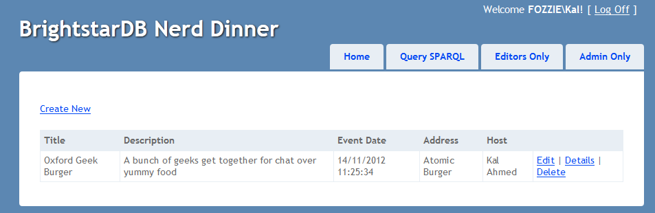

.. _Entity_Framework_Samples:

*************************
 Entity Framework Samples
*************************

The following samples provide detailed information on how to build applications using 
BrightstarDB. If there are classes of applications for which you would like to see other 
tutorials please let us know.

.. _Tweetbox:

Tweetbox
========

.. note::

  The source code for this example can be found in 
  [INSTALLDIR]\\Samples\\EntityFramework\\EntityFrameworkSamples.sln

Overview
--------

The TweetBox sample is a simple console application that shows the speed in which BrightstarDB 
can load content. The aim is not to create a Twitter style application, but to show how 
objects with various relationships to one another are loading quickly, in a structure that 
will be familiar to developers.

The model consists of 3 simple interfaces: ``IUser``, ``ITweet`` and ``IHashTag``. The relationships 
between the interfaces mimic the structure on Twitter, in that Users have a many to many 
relationship with other Users (or followers), and have a one to many relationship with Tweets. 
The tweets have a many to many relationship with Hashtags, as a Tweet can have zero or more 
Hashtags, and a Hashtag may appear in more than one Tweet.

The Interfaces 
---------------

**IUser**

The IUser interface represents a user on Twitter, with simple string properties for the 
username, bio (profile text) and date of registration. The 'Following' property shows the list 
of users that this user follows, the other end of this relationship is shown in the 
'Followers' property, this is marked with the 'InverseProperty' attribute to tell BrightstarDB 
that Followers is the other end of the Following relationship. The final property is a list of 
tweets that the user has authored, this is the other end of the relationship from the ITweet 
interface (described below):

.. code-block:: c#

  [Entity]
  public interface IUser
  {
      string Id { get; }
      string Username { get; set; }
      string Bio { get; set; }
      DateTime DateRegistered { get; set; }
      ICollection<IUser> Following { get; set; }
      [InverseProperty("Following")]
      ICollection<IUser> Followers { get; set; }
      [InverseProperty("Author")]
      ICollection<ITweet> Tweets { get; set; }        
  }

**ITweet**

The ITweet interface represents a tweet on twitter, and has simple properties for the tweet 
content and the date and time it was published. The Tweet has an IUser property ('Author') to 
relate it to the user who wrote it (the other end of this relationship is described above). 
ITweet also contains a collection of Hashtags that appear in the tweet (described below):

.. code-block:: c#

  [Entity]
  public interface ITweet
  {
      string Id { get; }
      string Content { get; set; }
      DateTime DatePublished { get; set; }
      IUser Author { get; set; }
      ICollection<IHashTag> HashTags { get; set; }
  }

**IHashTag**

A hashtag is a keyword that is contained in a tweet. The same hashtag may appear in more than 
one tweet, and so the collection of Tweets is marked with the 'InverseProperty' attribute to 
show that it is the other end of the collection of HashTags in the ITweet interface:

.. code-block:: c#

  [Entity]
  public interface IHashTag
  {
      string Id { get; }
      string Value { get; set; }
      [InverseProperty("HashTags")]
      ICollection<ITweet> Tweets { get; set; } 
  }

Initialising the BrightstarDB Context
-------------------------------------

The BrightstarDB context can be initialised using a connection string:

.. code-block:: c#

  var connectionString = 
      "Type=rest;endpoint=http://localhost:8090/brightstar;StoreName=Tweetbox";
  var context = new TweetBoxContext(connectionString);

If you have added the connection string into the Config file:

.. code-block:: xml

  <add key="BrightstarDB.ConnectionString" 
       value="Type=rest;endpoint=http://localhost:8090/brightstar;StoreName=Tweetbox" />

then you can initialise the content with a simple:

.. code-block:: c#

  var context = new TweetBoxContext();

For more information about connection strings, please read the 
:ref:`"Connection Strings" <Connection_Strings>` topic.

Creating a new User entity
--------------------------

Method 1:

.. code-block:: c#

  var jo = context.Users.Create();
  jo.Username = "JoBloggs79";
  jo.Bio = "A short sentence about this user";
  jo.DateRegistered = DateTime.Now;
  context.SaveChanges();

Method 2:

.. code-block:: c#

  var jo = new User {
                   Username = "JoBloggs79",
                   Bio = "A short sentence about this user",
                   DateRegistered = DateTime.Now
               };
  context.Users.Add(jo);
  context.SaveChanges();

Relationships between entities
------------------------------

The following code snippets show the creation of relationships between entities by simply 
setting properties.

**Users to Users**:

.. code-block:: c#

  var trevor = context.Users.Create();
  trevor.Username = "TrevorSims82";
  trevor.Bio = "A short sentence about this user";
  trevor.DateRegistered = DateTime.Now;
  trevor.Following.Add(jo);
  context.SaveChanges();

**Tweets to Tweeter**:

.. code-block:: c#

  var tweet = context.Tweets.Create();
  tweet.Content = "My first tweet";
  tweet.DatePublished = DateTime.Now;
  tweet.Tweeter = trevor;
  context.SaveChanges();

**Tweets to HashTags:**:

.. code-block:: c#

  var nosql = context.HashTags.Where(
	ht => ht.Value.Equals("nosql").FirstOrDefault();
  if (nosql == null)
  {
      nosql = context.HashTags.Create();
      nosql.Value = "nosql";
  }
  var  brightstardb = context.HashTags.Where(
	ht => ht.Value.Equals("brightstardb").FirstOrDefault();
  if (brightstardb == null)
  {
      brightstardb = context.HashTags.Create();
      brightstardb.Value = "brightstardb";
  }
  var tweet2 = context.Tweets.Create();
  tweet.Content = "New fast, scalable NoSQL database for the .NET platform";
  tweet.HashTags.Add(nosql);
  tweet.HashTags.Add(brightstar);
  tweet.DatePublished = DateTime.Now;
  tweet.Tweeter = trevor;
  context.SaveChanges();

Fast creation, persistence and indexing of data
-----------------------------------------------

In order to show the speed at which objects can be created, persisted and index in 
BrightstarDB, the console application creates 100 users, each with 500 tweets. Each of those 
tweets has 2 hashtags (chosen from a set of 10,000 hash tags). 

  1. Creates 100 users

  #. Creates 10,000 hashtags

  #. Saves the users and hashtags to the database

  #. Loops through the existing users and adds followers and tweets (each tweet has 2 random hashtags)

  #. Saves the changes back to the store

  #. Writes out the time taken to the console

.. _MVC_Nerd_Dinner:

MVC Nerd Dinner
===============

.. note::

  The source code for this example can be found in the solution 
  ``[INSTALLDIR]\Samples\NerdDinner\BrightstarDB.Samples.NerdDinner.sln``

To demonstrate the ease of using BrightstarDB with ASP.NET MVC, we will use the well-known 
“Nerd Dinner” tutorial used by .NET Developers when they first learn MVC. We won’t recreate 
the full Nerd Dinner application, but just a portion of it, to show how to use BrightstarDB 
for code-first data persistence, and show how it not only matches the ease of creating 
applications from scratch, but surpasses Entity Framework by introducing pain free model 
changes (more on that later). The Brightstar.NerdDinner sample application shows a simple 
model layer, using ASP.NET MVC4 for the CRUD application and BrightstarDB for data storage. In 
later sections we will extend this basic functionality with support for linked data in the 
form of both OData and SPARQL query support and we will show how to use BrightstarDB as the 
basis for a .NET custom membership and role provider.

This tutorial is quite long, but is broken up into a number of separate sections each of which 
you can follow along with in code, or you can refer to the complete sample application which 
can be found in ``[INSTALLDIR]\Samples\NerdDinner``.

  - :ref:`Creating The Basic Data Model <Creating_The_Basic_Data_Model>` - creates the initial 
    application and code-first data model

  - :ref:`Creating MVC Controllers and Views <Creating_MVC_Controllers_And_V>` - shows how 
    easy it is to use this model with ASP.NET MVC4 to create web interfaces for create, update 
    and delete (CRUD) operations.

  - :ref:`Applying Model Changes <Applying_Model_Changes>` - shows how BrightstarDB handles 
    changes to the code-first data model without data loss.

  - :ref:`Adding A Custom Membership Provider <Adding_a_Custom_Membership_Pro>` - describes 
    how to build a ASP.NET custom membership provider that uses BrightstarDB to manage user 
    account information.

  - :ref:`Adding A Custom Role Provider <Adding_a_Custom_Role_Provider>` - builds on the 
    custom membership provider to enable users to be assigned different roles and levels of access

  - :ref:`Adding Linked Data Support <Adding_Linked_Data_Support>` - extends the web 
    application to provide a SPARQL and an ODATA query endpoint

  - :ref:`Consuming OData In PowerPivot <Consuming_OData_in_PowerPivot>` - shows one way in 
    which the OData endpoint can be used - enabling data to be retrieved into Excel.

.. _Creating_The_Basic_Data_Model:

Creating The Basic Data Model
-----------------------------

.. _http://www.asp.net/mvc/mvc4: http://www.asp.net/mvc/mvc4

Creating the ASP.NET MVC4 Application.
^^^^^^^^^^^^^^^^^^^^^^^^^^^^^^^^^^^^^^

**Step 1: Create a New Empty ASP.NET MVC4 Application**

Choose “ASP.NET MVC 4 Web Application” from the list of project types in Visual Studio. If you 
do not already have MVC 4 installed you can download it from `http://www.asp.net/mvc/mvc4`_. 
You must also install the "Visual Web Developer" feature in Visual Studio to be able to open 
and work with MVC projects. Choose a name for your application (we are using 
BrightstarDB.Samples.NerdDinner), and then click OK. In the next dialog box, select “Empty” 
for the template type, this mean that the project will not be pre-filled with any default 
controllers, models or views so we can show every step in building the application. Choose 
“Razor” as the View Engine. Leave the “Create a unit test project” box unchecked, as for the 
purposes of this example project it is not needed.

**Step 2: Add references to BrightstarDB**

Install the BrightstarDB package from NuGet, either using the GUI tool or from the NuGet console with the command::

	Install-Package BrightstarDB

**Step 3: Add a connection string to your BrightstarDB location**

Open the web.config file in the root directory your new project, and add a connection string 
to the location of your BrightstarDB store. There is no setup required - you can name a store 
that does not exist and it will be created the first time that you try to connect to it from 
the application. The only thing you will need to ensure is that if you are using a REST connection,
the BrightstarDB service must be running:

.. code-block:: xml

  <appSettings>
    ...
    <add key="BrightstarDB.ConnectionString" 
         value="Type=rest;endpoint=http://localhost:8090/brightstar;StoreName=NerdDinner" />
    ...
  </appSettings>

For more information about connection strings, please read the :ref:`"Connection Strings" 
<Connection_Strings>` topic.

**Step 4: Rename the Brightstar Entity Context in your project**

The NuGet package will have installed a text template file named ``MyEntityContext.tt``. 
Rename it to ``NerdDinnerContext.tt``.

**Step 5: Creating the data model interfaces**

BrightstarDB data models are defined by a number of standard .NET interfaces with certain 
attributes set. The NerdDinner model is very simple (especially for this tutorial) and only 
consists of a set of “Dinners” that refer to specific events that people can attend, and also 
a set of “RSVP”s that are used to track a person’s interest in attending a dinner. 

We create the two interfaces as shown below in the Models folder of our project.

IDinner.cs:

.. code-block:: c#

  using System;
  using System.Collections.Generic;
  using System.ComponentModel.DataAnnotations;
  using BrightstarDB.EntityFramework;

  namespace BrightstarDB.Samples.NerdDinner.Models
  {
      [Entity]
      public interface IDinner
      {
          [Identifier("http://nerddinner.com/dinners/")]
          string Id { get; }

          [Required(ErrorMessage = "Please provide a title for the dinner")]
          string Title { get; set; }

          string Description { get; set; }

          [Display(Name = "Event Date")]
          [DataType(DataType.DateTime)]
          DateTime EventDate { get; set; }

          [Required(ErrorMessage = "The event must have an address.")]
          string Address { get; set; }

          [Required(ErrorMessage = "Please enter the name of the host of this event")]
          [Display(Name = "Host")]
          string HostedBy { get; set; }

          ICollection<IRSVP> RSVPs { get; set; }
      }
  }

IRSVP.cs:

.. code-block:: c#

  using System.ComponentModel.DataAnnotations;
  using BrightstarDB.EntityFramework;

  namespace BrightstarDB.Samples.NerdDinner.Models
  {
      [Entity]
      public interface IRSVP
      {
          [Identifier("http://nerddinner.com/rsvps/")]
          string Id { get; }

          [Display(Name = "Email Address")]
          [Required(ErrorMessage = "Email address is required")]
          string AttendeeEmail { get; set; }

          [InverseProperty("RSVPs")]
          IDinner Dinner { get; set; }
      }
  }

By default, BrightstarDB identifier properties are automatically generated URIs that are 
automatically. In order to work with simpler values for our entity Ids we decorate the Id 
property with an identifier attribute. This adds a prefix for BrightstarDB to use when 
generating and querying the entity identifiers and ensures that the actual value we get in the 
Id property is just the part of the URI that follows the prefix, which will be a simple GUID 
string.

In the IRSVP interface, we add an InverseProperty attribute to the Dinner property, and set it 
to the name of the .NET property on the referencing type ("RSVPs"). This shows that these two 
properties reflect different sides of the same association. In this case the association is a 
one-to-many relationship (one dinner can have many RSVPs), but BrightstarDB also supports 
many-to-many and many-to-one relationships using the same mechanism.

We can also add other attributes such as those from the ``System.ComponentModel.DataAnnotations`` 
namespace to provide additional hints for the MVC framework such as marking a property as 
required, providing an alternative display name for forms or specifying the way in which a 
property should be rendered. These additional attributes are automatically added to the 
classes generated by the BrightstarDB Entity Framework. For more information about 
BrightstarDB Entity Framework attributes and passing through additional attributes, please 
refer to the :ref:`Annotations <Annotations_Guide>` section of the :ref:`Entity Framework 
<Entity_Framework>` documentation.

**Step 6: Creating a context class to handle database persistence**

Right click on the Brightstar Entity Context and select **Run Custom Tool**. This runs the text 
templating tool that updates the .cs file contained within the .tt file with the most up to 
date persistence code needed for your interfaces. Any time you modify the interfaces that 
define your data model, you should re-run the text template to regenerate the context code.

We now have the basic data model for our application completed and have generated the code for 
creating persistent entities that match our data model and storing them in BrightstarDB. In 
the next section we will see how to use this data model and context in creating screens in our 
MVC application.

.. _Creating_MVC_Controllers_And_V:

Creating MVC Controllers And Views
----------------------------------

In the previous section we created the skeleton MVC application and added to it a BrightstarDB 
data model for dinners and RSVPs. In this section we will start to flesh out the MVC 
application with some screens for data entry and display.

Create the Home Controller
^^^^^^^^^^^^^^^^^^^^^^^^^^

Right click on the controller folder and select “Add > Controller”. Name it “HomeController” 
and select “Controller with empty Read/Write Actions”. This adds a Controller class to the 
folder, with empty actions for Index(), Details(), Create(),  Edit() and Delete(). This will 
be the main controller for all our CRUD operations. 

The basic MVC4 template for these operations makes a couple of assumptions that we need to 
correct. Firstly, the id parameter passed in to various operations is assumed to be an int; 
however our BrightstarDB entities use a string value for their Id, so we must change the int 
id parameters to string id on the Details, Edit and Delete actions. Secondly, by default the 
HttpPost actions for the Create and Edit actions accept FormCollection parameters, but because 
we have a data model available it is easier to work with the entity class, so we will change 
these methods to accept our data model’s classes as parameters rather than FormCollection and 
let the MVC framework handle the data binding for us - for the Delete action it does not 
really matter as we are not concerned with the value posted back by that action in this sample 
application.

Before we start editing the Actions, we add the following line to the HomeController class:

.. code-block:: c#

  public class HomeController : Controller
  {        
          NerdDinnerContext _nerdDinners = new NerdDinnerContext();
  ...
  }

This ensures that any action invoked on the controller can access the BrightstarDB entity 
framework context.

**Index**

This view will show a list of all dinners in the system, it’s a simple case of using LINQ to 
return a list of all dinners:

.. code-block:: c#

  public ActionResult Index()
  {
      var dinners = from d in _nerdDinners.Dinners
                    select d;
      return View(dinners.ToList());
  }

**Details**

This view shows all the details of a particular dinner, so we use LINQ again to query the 
store for a dinner with a particular Id. Note that we have changed the type of the id 
parameter from int to string. The LINQ query here uses FirstOrDefault() which means that if 
there is no dinner with the specified ID, we will get a null value returned by the query. If 
that is the case, we return the user to a "404" view to display a "Not found" message in the 
browser, otherwise we return the default Details view.

.. code-block:: c#

  public ActionResult Details(string id)
  {
      var dinner = _nerdDinners.Dinners.FirstOrDefault(d => d.Id.Equals(id));
      return dinner == null ? View("404") : View(dinner);
  }

**Edit**

The controller has two methods to deal with the Edit action, the first handles a get request 
and is similar to the Details method above, but the view loads the property values into a form 
ready to be edited. As with the previous method, the type of the id parameter has been changed 
to string:

.. code-block:: c#

  public ActionResult Edit(string id)
  {
      var dinner = _nerdDinners.Dinners.Where(d => d.Id.Equals(id)).FirstOrDefault();
      return dinner == null ? View("404") : View(dinner);
  }

The method that accept the HttpPost that is sent back after a user clicks “Save” on the view, 
deals with updating the property values in the store. Note that rather than receiving the id 
and FormsCollection parameters provided by the default scaffolding, we change this method to 
receive a Dinner object. The Dinner class is generated by the BrightstarDB Entity Framework 
from our IDinner data model interface and the MVC framework can automatically data bind the 
values in the edit form to a new Dinner instance before invoking our Edit method. This 
automatic data binding makes the code to save the edited dinner much simpler and shorter - we 
just need to attach the Dinner object to the _nerdDinners context and then call SaveChanges() 
on the context to persist the updated entity:

.. code-block:: c#

  [HttpPost]
  public ActionResult Edit(Dinner dinner)
  {
      if(ModelState.IsValid)
      {
          dinner.Context = _nerdDinners;
          _nerdDinners.SaveChanges();
          return RedirectToAction("Index");
      }
      return View();
  }

**Create**

Like the Edit method, Create displays a form on the initial view, and then accepts the 
HttpPost that gets sent back after a user clicks “Save”. To make things slight easier for the 
user we are pre-filling the “EventDate” property with a date one week in the future:

.. code-block:: c#

  public ActionResult Create()
  {
     var dinner = new Dinner {EventDate = DateTime.Now.AddDays(7)};
     return View(dinner);
  }

When the user has entered the rest of the dinner details, we add the Dinner object to the 
Dinners collection in the context and then call SaveChanges():

.. code-block:: c#

  [HttpPost]
  public ActionResult Create(Dinner dinner)
  {
      if(ModelState.IsValid)
      {
          _nerdDinners.Dinners.Add(dinner);
          _nerdDinners.SaveChanges();
          return RedirectToAction("Index");
      }
      return View();
  }

**Delete**

The first stage of the Delete method displays the details of the dinner about to be deleted to 
the user for confirmation:

.. code-block:: c#

  public ActionResult Delete(string id)
  {
      var dinner = _nerdDinners.Dinners.Where(d => d.Id.Equals(id)).FirstOrDefault();
      return dinner == null ? View("404") : View(dinner);
  }

When the user has confirmed the object is Deleted from the store:

.. code-block:: c#

  [HttpPost, ActionName("Delete")]
  public ActionResult DeleteConfirmed(string id, FormCollection collection)
  {
      var dinner = _nerdDinners.Dinners.FirstOrDefault(d => d.Id.Equals(id));
      if (dinner != null)
      {
          _nerdDinners.DeleteObject(dinner);
          _nerdDinners.SaveChanges();
      }
      return RedirectToAction("Index");
  }

Adding views
^^^^^^^^^^^^

Now that we have filled in the logic for the actions, we can proceed to create the necessary 
views. These views will make use of the Microsoft JQuery Unobtrusive Validation nuget package. 
You can install this package through the GUI Nuget package manager or using the NuGet console 
command::

  PM> install-package Microsoft.jQuery.Unobtrusive.Validation

This will also install the jQuery and jQuery.Validation packages that are dependencies.

Before creating specific views, we can create a common look and feel for these views by 
creating a _ViewStart.cshtml and a shared _Layout.cshtml. This approach also makes the Razor 
for the individual views simpler and easier to manage. Please refer to the sample solution for 
the content of these files and the 404 view that is displayed when a URL specifies an ID that 
cannot be resolved.

All of the views for the Home controller need to go in the Home folder under the Views folder 
- if it does not exist yet, create the Home folder within the Views folder of the MVC 
solution. Then, to Add a view, right click on the “Home” folder within “Views” and select “Add 
> View”. For each view we create a strongly-typed view with the appropriate scaffold template 
and create it as a partial view.

The Index View uses a List template, and the IDinner model:

.. note::

  If the IDinner type is not displayed in the "Model class" drop-down list, this may be 
  because Visual Studio is not aware of the type yet - to fix this, you must save and compile 
  the solution before trying to add views.

.. _this blog post: http://techquila.com/tech/2012/11/mvc4-list-view-template-error-column-attribute-is-an-ambiguous-reference/

.. note::

  If you get an error from Visual Studio when trying to add this view, please see 
  `this blog post`_ for a possible solution.

The Details View uses the Details template:

The Edit View uses the Edit template and also includes script library references. You may want to 
modify the reference to the jquery-1.7.1.min.js script from the generated template to point to 
the version of jQuery installed by the validation NuGet package (this is jquery-1.4.4.min.js 
at the time of writing).

The Create View uses the Create template and again includes the script library references, 
which you should modify in the same way as you did for the Edit view.

The Delete view uses the Delete template:

Adding strongly typed views in this way pre-populates the HTML with tables, forms and text 
where needed to display information and gather data from the user.

Review Site
^^^^^^^^^^^

We have now implemented all of the code we need to write within our Controller and Views to 
implement the Dinner listing and Dinner creation functionality within our web application. 
Running the web application for the first time should display a home page with an empty list 
of dinners:

Clicking on the Create New link takes you to the form for entering the details for a new 
dinner. Note that this form supports some basic validation through the annotation attributes 
we added to the model. For example the name of the dinner host is required:

Once a dinner is created it shows up in the list on the home page from where you can view 
details, edit or delete the dinner:

However, we still have no way of registering attendees! To do that we need to add another 
action that will allow us to create an RSVP and attach it to a dinner.

Create the AddAttendee Action
^^^^^^^^^^^^^^^^^^^^^^^^^^^^^

Like the Create, Edit and Delete actions, AddAttendee will be an action with two parts to it. 
The first part of the action, invoked by an HTTP GET (a normal link) will display a form in 
which the user can enter the email address they want to use for the RSVP. The second part of 
the action will handle the HTTP POST generated by that form when the user submits it - this 
part will use the details in the form to create a new RSVP entity and connect it to the 
correct event. The action will be created in the Home controller, so new methods will be added 
to HomeController.cs.

This is the code for the first part of AddAttendee action - it is a similar pattern that we 
have seen else where. We retrieve the dinner entity by its ID and pass it through to the view 
so we can show the user some details about the dinner they have chosen to attend:

.. code-block:: c#

  public ActionResult AddAttendee(string id)
  {
      var dinner = _nerdDinners.Dinners.FirstOrDefault(x => x.Id.Equals(id));
      ViewBag.Dinner = dinner;
      return dinner == null ? View("404") : View();
  }

The view invoked by this action needs to be added to the Views/Home folder as 
AddAttendee.cshtml. Create a new view, named AddAttendee and strongly typed using the IDinner 
type but choose the Empty scaffold  and check "Create as partial view" and then edit the 
.cshtml file like this::

  @model BrightstarDB.Samples.NerdDinner.Models.IRSVP

  <h3>Join A Dinner</h3>
  
To join the dinner @ViewBag.Dinner.Title on @ViewBag.Dinner.EventDate.ToLongDateString(), 
     enter your email address below and click RSVP.

  @using(@Html.BeginForm("AddAttendee", "Home")) {
      @Html.ValidationSummary(true)
      @Html.Hidden("DinnerId", ViewBag.Dinner.Id as string)
      
@Html.LabelFor(m=>m.AttendeeEmail)

      

          @Html.EditorFor(m=>m.AttendeeEmail) 
          @Html.ValidationMessageFor(m=>m.AttendeeEmail)
      

      
<input type="submit" value="Register"/>

  }
  

      @Html.ActionLink("Back To List", "Index")
  

Note the use of a hidden field in the form that carries the Dinner ID so that when we handle 
the POST we know which dinner to connect the response to.

This is the code to handle the second part of the action:

.. code-block:: c#

  [HttpPost]
  public ActionResult AddAttendee(FormCollection form)
  {
      if (ModelState.IsValid)
      {
          var rsvpDinnerId = form["DinnerId"];
          var dinner = _nerdDinners.Dinners.FirstOrDefault(d => d.Id.Equals(rsvpDinnerId));
          if (dinner != null)
          {
              var rsvp= new RSVP{AttendeeEmail = form["AttendeeEmail"], Dinner = dinner};
              _nerdDinners.RSVPs.Add(rsvp);
              _nerdDinners.SaveChanges();
              return RedirectToAction("Details", new {id = rsvp.Dinner.Id});
          }
      }
      return View();
  }

Here we do not use the MVC framework to data-bind the form values to an RSVP object because it 
will attempt to put the ID from the URL (which is the dinner ID) into the Id field of the 
RSVP, which is not what we want. Instead we just get the FormCollection to allow us to 
retrieve the form values. The code retrieves the DinnerId from the form and uses that to get 
the IDinner entity from BrightstarDB. A new RSVP entity is then created using the 
AttendeeEmail value from the form and the dinner entity just found. The RSVP is then added to 
the BrightstarDB RSVPs collection and SaveChanges() is called to persist it. Finally the user 
is returned to the details page for the dinner.

Next, we modify the Details view so that it shows all attendees of a dinner. This is the 
updated CSHTML for the Details view::

  @model BrightstarDB.Samples.NerdDinner.Models.IDinner

  <fieldset>
      <legend>IDinner</legend>

      

           @Html.DisplayNameFor(model => model.Title)
      

      

          @Html.DisplayFor(model => model.Title)
      

      

           @Html.DisplayNameFor(model => model.Description)
      

      

          @Html.DisplayFor(model => model.Description)
      

      

           @Html.DisplayNameFor(model => model.EventDate)
      

      

          @Html.DisplayFor(model => model.EventDate)
      

      

           @Html.DisplayNameFor(model => model.Address)
      

      

          @Html.DisplayFor(model => model.Address)
      

      

           @Html.DisplayNameFor(model => model.HostedBy)
      

      

          @Html.DisplayFor(model => model.HostedBy)
      

      
      

          @Html.DisplayNameFor(model=>model.RSVPs)
      

      

          @if (Model.RSVPs != null)
          {
              <ul>
                  @foreach (var r in Model.RSVPs)
                  {
                      <li>@r.AttendeeEmail</li>
                  }
              </ul>
          }
      

  </fieldset>
  

      @Html.ActionLink("Edit", "Edit", new { id=Model.Id }) |
      @Html.ActionLink("Back to List", "Index")
  

Finally we modify the Index view to add an Add Attendee action link to each row in the table. 
This is the updated CSHTML for the Index view::

  @model IEnumerable<BrightstarDB.Samples.NerdDinner.Models.IDinner>

  

      @Html.ActionLink("Create New", "Create")
  

  <table>
      <tr>
          <th>
              @Html.DisplayNameFor(model => model.Title)
          </th>
          <th>
              @Html.DisplayNameFor(model => model.Description)
          </th>
          <th>
              @Html.DisplayNameFor(model => model.EventDate)
          </th>
          <th>
              @Html.DisplayNameFor(model => model.Address)
          </th>
          <th>
              @Html.DisplayNameFor(model => model.HostedBy)
          </th>
          <th></th>
      </tr>

  @foreach (var item in Model) {
      <tr>
          <td>
              @Html.DisplayFor(modelItem => item.Title)
          </td>
          <td>
              @Html.DisplayFor(modelItem => item.Description)
          </td>
          <td>
              @Html.DisplayFor(modelItem => item.EventDate)
          </td>
          <td>
              @Html.DisplayFor(modelItem => item.Address)
          </td>
          <td>
              @Html.DisplayFor(modelItem => item.HostedBy)
          </td>
          <td>
              @Html.ActionLink("Add Attendee", "AddAttendee", new { id=item.Id }) |
              @Html.ActionLink("Edit", "Edit", new { id=item.Id }) |
              @Html.ActionLink("Details", "Details", new { id=item.Id }) |
              @Html.ActionLink("Delete", "Delete", new { id=item.Id })
          </td>
      </tr>
  }

  </table>

Now we can use the Add Attendee link on the home page to register attendance at an event:

And we can then see this registration on the event details page:

.. _Applying_Model_Changes:

Applying Model Changes
----------------------

Change during development happens and many times, changes impact the persistent data model. 
Fortunately it is easy to modify the persistent data model with BrightstarDB.

As an example we are going to add the requirement for dinners to have a specific City field 
(perhaps to allow grouping of dinners by the city the occur in for example).

The first step is to modify the IDinner interface to add a City property:

.. code-block:: c#

      [Entity]
      public interface IDinner
      {
          [Identifer("http://nerddinner.com/dinners#")]
          string Id { get; }
          string Title { get; set; }
          string Description { get; set; }
          DateTime EventDate { get; set; }
          string Address { get; set; }
          string City { get; set; }
          string HostedBy { get; set; }
          ICollection<IRSVP> RSVPs { get; set; } 
      }

Because this change modifies an entity interface, we need to ensure that the generated context 
classes are also updated. To update the context, right click on the NerdDinnerContext.tt and 
select “Run Custom Tool”

That is all that needs to be done from a BrightstarDB point of view! The City property is now 
assignable on all new and existing Dinner entities and you can write LINQ queries that make 
use of the City property. Of course, there are still a couple of things that need to change in 
our web interface. Open the Index, Create, Delete, Details and Edit views to add the new City 
property to the HTML so that you will be able to view and amend its data - the existing HTML 
in each of these views should provide you with the examples you need.

Note that if you create a new dinner, you will be required to enter a City, but existing 
dinners will not have a city assigned:

If you use a query to find or group dinners by their city, those dinners that have no value 
for the city will not be returned by the query, and of course if you try to edit one of those 
dinners, then you will be required to provide a value for the City field.

.. _Adding_a_Custom_Membership_Pro:

Adding a Custom Membership Provider
-----------------------------------

Custom Membership Providers are a quick and straightforward way of managing membership 
information when you wish to store that membership data in a data source that is not supported 
by the membership providers included within the .NET framework. Often developers will need to 
implement custom membership providers even when storing the data in a supported data source, 
because the schema of that membership information differs from that in the default providers.

In this topic we are going to add a Custom Membership Provider to the Nerd Dinner sample so 
that users can register and login.

Adding the Custom Membership Provider and login Entity
^^^^^^^^^^^^^^^^^^^^^^^^^^^^^^^^^^^^^^^^^^^^^^^^^^^^^^

  1. Add a new class to your project and name it BrightstarMembershipProvider.cs

  #. Make the class extend System.Web.Security.MembershipProvider. This is the abstract class 
     that all ASP.NET membership providers must inherit from.

  #. Right click on the MembershipProvider class name and choose “Implement abstract class” 
     from the context menu, this automatically creates all the override methods that your custom 
     class can implement.

  #. Add a new interface to the Models directory and name it INerdDinnerLogin.cs

  #. Add the [Entity] attribute to the interface, and add the properties shown below:

  #. The Id property is decorated with the Identifier attribute to allow us to work with 
     simpler string values rather than the full URI that is generated by BrightstarDB (for more 
     information, please read the Entity Framework Documentation).

.. code-block:: c#

  [Entity]
  public interface INerdDinnerLogin
  {
     [Identifier("http://nerddinner.com/logins/")]
     string Id { get; }
     string Username { get; set; }
     string Password { get; set; }
     string PasswordSalt { get; set; }
     string Email { get; set; }
     string Comments { get; set; }
     DateTime CreatedDate { get; set; }
     DateTime LastActive { get; set; }
     DateTime LastLoginDate { get; set; }
     bool IsActivated { get; set; }
     bool IsLockedOut { get; set; }
     DateTime LastLockedOutDate { get; set; }
     string LastLockedOutReason { get; set; }
     int? LoginAttempts { get; set; } 
  }

To update the Brightstar Entity Context, right click on the NerdDinnerContext.tt file and 
select “Run Custom Tool” from the context menu.

Configuring the application to use the Brightstar Membership Provider
^^^^^^^^^^^^^^^^^^^^^^^^^^^^^^^^^^^^^^^^^^^^^^^^^^^^^^^^^^^^^^^^^^^^^

To configure your web application to use this custom Membership Provider, we simply need to 
change the configuration values in the Web.config file in the root directory of the 
application. Change the membership node contained within the <system.web> to the 
snippet below:

.. code-block:: xml

  <membership defaultProvider="BrightstarMembershipProvider">
    <providers>
      <clear/>
      <add name="BrightstarMembershipProvider" 
           type="BrightstarDB.Samples.NerdDinner.BrightstarMembershipProvider, BrightStarDB.Samples.NerdDinner" 
           enablePasswordReset="true" 
           maxInvalidPasswordAttempts="5" 
           minRequiredPasswordLength="6" 
           minRequiredNonalphanumericCharacters="0" 
           passwordAttemptWindow="10" 
           applicationName="/" />
    </providers>
  </membership> 

Note that if the name of your project is not ``BrightstarDB.Samples.NerdDinner``, you will have to 
change the ``type=""`` attribute to the correct full type reference. 

We must also change the authentication method for the web application to Forms authentication. 
This is done by adding the following inside the <system.web> section of the Web.config file:

.. code-block:: xml

  <authentication mode="Forms"/>

If after making these changes you see an error message like this in the browser::

  Parser Error Message: It is an error to use a section registered as 
  allowDefinition='MachineToApplication' beyond application level.  This error can be caused by 
  a virtual directory not being configured as an application in IIS.

The most likely problem is that you have added the ``<membership>`` and ``<authentication>`` tags into 
the Web.config file contained in the Views folder. These configuration elements must ONLY go 
in the Web.config file located in the project's root directory.

Adding functionality to the Custom Membership Provider
^^^^^^^^^^^^^^^^^^^^^^^^^^^^^^^^^^^^^^^^^^^^^^^^^^^^^^

.. note::

  For the purpose of keeping this example simple, we will leave some of these methods to throw 
  ``System.NotImplementedException``, but you can add in whatever logic suits your business requirements 
  once you have the basic functionality up and running.

The full code for the ``BrightstarMembershipProvider.cs`` is given below, but can be broken down 
as follows:

**Initialization**

We add an ``Initialize()`` method along with a ``GetConfigValue()`` helper method to handle retrieving 
the configuration values from `Web.config`, and setting default values if it is unable to 
retrieve a value.

**Private helper methods**

We add three more helper methods: ``CreateSalt()`` and ``CreatePasswordHash()`` to help us with user 
passwords, and ``ConvertLoginToMembershipUser()`` to return a built in .NET MembershipUser object 
when given the BrightstarDB ``INerdDinnerLogin`` entity.

**CreateUser()**

The ``CreateUser()`` method is used when a user registers on our site, the first part of this code 
validates based on the configuration settings (such as whether an email must be unique) and 
then creates a NerdDinnerLogin entity, adds it to the NerdDinnerContext and saves the changes 
to the BrightstarDB store.

**GetUser()**

The ``GetUser()`` method simply looks up a login in the BrightstarDB store, and returns a .NET 
MembershipUser object with the help of the ``ConvertLoginToMembershipUser()`` method mentioned 
above.

**GetUserNameByEmail()**

The ``GetUserNameByEmail()`` method is similar to the ``GetUser()`` method but looks up by email 
rather than username. It’s used by the ``CreateUser()`` method if the configuration settings 
specify that new users must have unique emails.

**ValidateUser()**

The ``ValidateUser()`` method is used when a user logs in to our web application. The login is 
looked up in the BrightstarDB store by username, and then the password is checked. If the 
checks pass successfully then it returns a true value which enables the user to successfully 
login.

.. code-block:: c#

  using System;
  using System.Collections.Specialized;
  using System.Linq;
  using System.Security.Cryptography;
  using System.Web.Security;
  using BrightstarDB.Samples.NerdDinner.Models;

  namespace BrightstarDB.Samples.NerdDinner
  {
      public class BrightstarMembershipProvider : MembershipProvider
      {
          #region Configuration and Initialization

          private string _applicationName;
          private const bool _requiresUniqueEmail = true;
          private int _maxInvalidPasswordAttempts;
          private int _passwordAttemptWindow;
          private int _minRequiredPasswordLength;
          private int _minRequiredNonalphanumericCharacters;
          private bool _enablePasswordReset;
          private string _passwordStrengthRegularExpression;
          private MembershipPasswordFormat _passwordFormat = MembershipPasswordFormat.Hashed;

          private string GetConfigValue(string configValue, string defaultValue)
          {
              if (string.IsNullOrEmpty(configValue))
                  return defaultValue;

              return configValue;
          }

          public override void Initialize(string name, NameValueCollection config)
          {
              if (config == null) throw new ArgumentNullException("config");

              if (string.IsNullOrEmpty(name)) name = "BrightstarMembershipProvider";

              if (String.IsNullOrEmpty(config["description"]))
              {
                  config.Remove("description");
                  config.Add("description", "BrightstarDB Membership Provider");
              }

              base.Initialize(name, config);

              _applicationName = GetConfigValue(config["applicationName"],
                            System.Web.Hosting.HostingEnvironment.ApplicationVirtualPath);
              _maxInvalidPasswordAttempts = Convert.ToInt32(
                            GetConfigValue(config["maxInvalidPasswordAttempts"], "10"));
              _passwordAttemptWindow = Convert.ToInt32(
                            GetConfigValue(config["passwordAttemptWindow"], "10"));
              _minRequiredNonalphanumericCharacters = Convert.ToInt32(
                            GetConfigValue(config["minRequiredNonalphanumericCharacters"], 
                                           "1"));
              _minRequiredPasswordLength = Convert.ToInt32(
                            GetConfigValue(config["minRequiredPasswordLength"], "6"));
              _enablePasswordReset = Convert.ToBoolean(
                            GetConfigValue(config["enablePasswordReset"], "true"));
              _passwordStrengthRegularExpression = Convert.ToString(
                             GetConfigValue(config["passwordStrengthRegularExpression"], ""));
          }
          
          #endregion

          #region Properties

          public override string ApplicationName
          {
              get { return _applicationName; }
              set { _applicationName = value; }
          }

          public override int MaxInvalidPasswordAttempts
          {
              get { return _maxInvalidPasswordAttempts; }
          }

          public override int MinRequiredNonAlphanumericCharacters
          {
              get { return _minRequiredNonalphanumericCharacters; }
          }

          public override int MinRequiredPasswordLength
          {
              get { return _minRequiredPasswordLength; }
          }

          public override int PasswordAttemptWindow
          {
              get { return _passwordAttemptWindow; }
          }

          public override MembershipPasswordFormat PasswordFormat
          {
              get { return _passwordFormat; }
          }

          public override string PasswordStrengthRegularExpression
          {
              get { return _passwordStrengthRegularExpression; }
          }

          public override bool RequiresUniqueEmail
          {
              get { return _requiresUniqueEmail; }
          }
          #endregion

          #region Private Methods

          private static string CreateSalt()
          {
              var rng = new RNGCryptoServiceProvider();
              var buffer = new byte[32];
              rng.GetBytes(buffer);
              return Convert.ToBase64String(buffer);
          }

          private static string CreatePasswordHash(string password, string salt)
          {
              var snp = string.Concat(password, salt);
              var hashed = FormsAuthentication.HashPasswordForStoringInConfigFile(snp, "sha1");
              return hashed;
          }
         
          /// 

          /// This helper method returns a .NET MembershipUser object generated from the 
          /// supplied BrightstarDB entity
          /// 

          private static MembershipUser ConvertLoginToMembershipUser(INerdDinnerLogin login)
          {
              if (login == null) return null;
              var user = new MembershipUser("BrightstarMembershipProvider",
                  login.Username, login.Id, login.Email,
                  "", "", login.IsActivated, login.IsLockedOut,
                  login.CreatedDate, login.LastLoginDate,
                  login.LastActive, DateTime.UtcNow, login.LastLockedOutDate);
              return user;
          }

          #endregion

          public override MembershipUser CreateUser(
				string username, 
				string password, 
				string email, 
				string passwordQuestion, 
				string passwordAnswer, 
				bool isApproved, 
				object providerUserKey, 
				out MembershipCreateStatus status)
          {
              var args = new ValidatePasswordEventArgs(email, password, true);

              OnValidatingPassword(args);

              if (args.Cancel)
              {
                  status = MembershipCreateStatus.InvalidPassword;
                  return null;
              }

              if (string.IsNullOrEmpty(email))
              {
                  status = MembershipCreateStatus.InvalidEmail;
                  return null;
              }

              if (string.IsNullOrEmpty(password))
              {
                  status = MembershipCreateStatus.InvalidPassword;
                  return null;
              }

              if (RequiresUniqueEmail && GetUserNameByEmail(email) != "")
              {
                  status = MembershipCreateStatus.DuplicateEmail;
                  return null;
              }

              var u = GetUser(username, false);

              try
              {
                  if (u == null)
                  {
                      var salt = CreateSalt();
                      
                      //Create a new NerdDinnerLogin entity and set the properties
                      var login = new NerdDinnerLogin
                      {
                          Username = username,
                          Email = email,
                          PasswordSalt = salt,
                          Password = CreatePasswordHash(password, salt),
                          CreatedDate = DateTime.UtcNow,
                          IsActivated = true,
                          IsLockedOut = false,
                          LastLockedOutDate = DateTime.UtcNow,
                          LastLoginDate = DateTime.UtcNow,
                          LastActive = DateTime.UtcNow
                      };
   
                      //Create a context using the connection string in the Web.Config
                      var context = new NerdDinnerContext();
   
                      //Add the entity to the context
                      context.NerdDinnerLogins.Add(login);
   
                      //Save the changes to the BrightstarDB store
                      context.SaveChanges();

                      status = MembershipCreateStatus.Success;
                      return GetUser(username, true /*online*/);
                  }
              }
              catch (Exception)
              {
                  status = MembershipCreateStatus.ProviderError;
                  return null;
              }

              status = MembershipCreateStatus.DuplicateUserName;
              return null;
          }

          public override MembershipUser GetUser(string username, bool userIsOnline)
          {
              if (string.IsNullOrEmpty(username)) return null;
              //Create a context using the connection string in Web.config
              var context = new NerdDinnerContext();
              //Query the store for a NerdDinnerLogin that matches the supplied username
              var login = context.NerdDinnerLogins.Where(l => 
                                    l.Username.Equals(username)).FirstOrDefault();
              if (login == null) return null;
              if(userIsOnline)
              {
                  // if the call states that the user is online, update the LastActive property 
                  // of the NerdDinnerLogin
                  login.LastActive = DateTime.UtcNow;
                  context.SaveChanges();
              }
              return ConvertLoginToMembershipUser(login);
          }

          public override string GetUserNameByEmail(string email)
          {
              if (string.IsNullOrEmpty(email)) return "";
              //Create a context using the connection string in Web.config
              var context = new NerdDinnerContext();
              //Query the store for a NerdDinnerLogin that matches the supplied username
              var login = context.NerdDinnerLogins.Where(l => 
                                    l.Email.Equals(email)).FirstOrDefault();
              if (login == null) return string.Empty;
              return login.Username;
          }
          
          public override bool ValidateUser(string username, string password)
          {
              //Create a context using the connection string set in Web.config
              var context = new NerdDinnerContext();
              //Query the store for a NerdDinnerLogin matching the supplied username
              var logins = context.NerdDinnerLogins.Where(l => l.Username.Equals(username));
              if (logins.Count() == 1)
              {
                  //Ensure that only a single login matches the supplied username
                  var login = logins.First();
                  // Check the properties on the NerdDinnerLogin to ensure the user account is 
                  // activated and not locked out
                  if (login.IsLockedOut || !login.IsActivated) return false;
                  // Validate the password of the NerdDinnerLogin against the supplied password
                  var validatePassword = login.Password == CreatePasswordHash(password, login.PasswordSalt);
                  if (!validatePassword)
                  {
                      //return validation failure
                      return false;
                  }
                  //return validation success
                  return true;
              }
              return false;
          }

          #region MembershipProvider properties and methods not implemented for this tutorial
  ...
          #endregion
          
      }
  }

Extending the MVC application
^^^^^^^^^^^^^^^^^^^^^^^^^^^^^

All the models, views and controllers needed to implement the logic logic are generated 
automatically when creating a new MVC4 Web Application if the option for "Internet 
Application" is selected. However, if you are following this tutorial through from the 
beginning you will need to add this infrastructure by hand. The infrastructure includes:

  - An AccountController class with ActionResult methods for logging in, logging out and 
    registering (in ``AccountController.cs`` in the Controllers folder).

  - ``AccountModels.cs`` which contains classes for LogonModel and RegisterModel (in the Models 
    folder).

  - LogOn, Register, ChangePassword and ChangePasswordSuccess views that use the models to 
    display form fields and validate input from the user (in the Views/Account folder).

  - A _LogOnPartial view that is used in the main _Layout view to display a login link, or the 
    username if the user is logged in (in the Views/Shared folder).

.. note::

  These files can be found in [INSTALLDIR]\\Samples\\NerdDinner\\BrightstarDB.Samples.NerdDinner

The details of the contents of these files is beyond the scope of this tutorial, however the 
infrastructure is all designed to work with the configured Membership Provider for the web 
application - in our case the ``BrightstarMembershipProvider`` class we have just created.

The AccountController created here has some dependencies on the Custom Role Provider discussed 
in the next section. You will need to complete the steps in the next section before you will 
be able to successfully register a user in the web application.

**Summary**

In this tutorial we have walked through some simple steps to use a Custom Membership Provider 
to allow BrightstarDB to handle the authentication of users on your MVC3 Web Application.

For simplicity, we have kept the same structure of membership information as we would find in 
a default provider, but you can expand on this sample to include extra membership information 
by simply adding more properties to the BrightstarDB entity.

.. _Adding_a_Custom_Role_Provider:

Adding a Custom Role Provider
-----------------------------

As with Custom Membership Providers, Custom Role Providers allow developers to use role 
management within application when either the role information is stored in a data source 
other than that supported by the default providers, or the role information is managed in a 
schema which differs from that set out in the default providers.

In this topic we are going to add a Custom Role Provider to the Nerd Dinner sample so that we 
can restrict certain areas from users who are not members of the appropriate role.

Adding the Custom Role Provider
^^^^^^^^^^^^^^^^^^^^^^^^^^^^^^^

  1. Add the following line to the INerdDinnerLogin interface's properties:
	 .. code-block:: c#
	 
	    ICollection<string> Roles { get; set; }

  2. To update the context classes, right click on the NerdDinnerContext.tt file and select “Run Custom Tool” from the context menu.

  #. Add a new class to your project and name it BrightstarRoleProvider.cs

  #. Make this new class inherit from the RoleProvider class (System.Web.Security namespace)

  #. Right click on the RoleProvider class name and choose "Implement abstract class" from the 
     context menu, this automatically creates all the override methods that your custom class can 
     implement.

Configuring the application to use the Brightstar Membership Provider
^^^^^^^^^^^^^^^^^^^^^^^^^^^^^^^^^^^^^^^^^^^^^^^^^^^^^^^^^^^^^^^^^^^^^

To configure your web application to use the Custom Role Provider, add the following to your 
Web.config, inside the <system.web> section:

.. code-block:: xml

  <roleManager  enabled="true" defaultProvider="BrightstarRoleProvider">
    <providers>
      <clear/>
      <add name="BrightstarRoleProvider" 
           type="BrightstarDB.Samples.NerdDinner.BrightstarRoleProvider" 
		   applicationName="/" />
    </providers>
  </roleManager>

To set up the default login path for the web application, replace the <authentication> element 
in the Web.config file with the following:

.. code-block:: xml

  <authentication mode="Forms">
    <forms loginUrl="/Account/LogOn"/>
  </authentication>

Adding functionality to the Custom Role Provider
^^^^^^^^^^^^^^^^^^^^^^^^^^^^^^^^^^^^^^^^^^^^^^^^

The full code for the ``BrightstarRoleProvider.cs`` is given below, but can be broken down as 
follows:

**Initialization**

We add an ``Initialize()`` method along with a ``GetConfigValue()`` helper method to handle retrieving 
the configuration values from Web.config, and setting default values if it is unable to 
retrieve a value.

**GetRolesForUser()**

This method returns the contents of the Roles collection that we added to the INerdDinnerLogin 
entity as a string array.

**AddUsersToRoles()**

This method loops through the usernames and role names supplied, and looks up the logins 
from the BrightstarDB store. When found, the role names are added to the Roles collection for 
that login.

**RemoveUsersFromRoles()**

This method loops through the usernames and role names supplied, and looks up the 
logins from the BrightstarDB store. When found, the role names are removed from the Roles 
collection for that login.

**IsUserInRole()**

The BrightstarDB store is searched for the login who matches the supplied username, and then a 
true or false is passed back depending on whether the role name was found in that login's Role 
collection. If the login is inactive or locked out for any reason, then a false value is 
passed back.

**GetUsersInRole()**

BrightstarDB is queried for all logins that contain the supplied role name in their Roles 
collection.

.. code-block:: c#

  using System;
  using System.Collections.Generic;
  using System.Linq;
  using System.Web;
  using System.Web.Security;
  using BrightstarDB.Samples.NerdDinner.Models;

  namespace BrightstarDB.Samples.NerdDinner
  {
      public class BrightstarRoleProvider : RoleProvider
      {
          #region Initialization
          
          private string _applicationName;

          private static string GetConfigValue(string configValue, string defaultValue)
          {
              if (string.IsNullOrEmpty(configValue))
                  return defaultValue;
              return configValue;
          }

          public override void Initialize(string name, 
                             System.Collections.Specialized.NameValueCollection config)
          {
              if (config == null) throw new ArgumentNullException("config");
              if (string.IsNullOrEmpty(name)) name = "NerdDinnerRoleProvider";
              if (string.IsNullOrEmpty(config["description"]))
              {
                  config.Remove("description");
                  config.Add("description", "Nerd Dinner Membership Provider");
              }
              base.Initialize(name, config);
              _applicationName = GetConfigValue(config["applicationName"],
                            System.Web.Hosting.HostingEnvironment.ApplicationVirtualPath);
          }
          
          #endregion

          /// 

          /// Gets a list of the roles that a specified user is in for the configured 
          /// applicationName.
          /// 

          /// <returns>
          /// A string array containing the names of all the roles that the specified user is 
          /// in for the configured applicationName.
          /// </returns>
          /// <param name="username">The user to return a list of roles for.</param>
          public override string[] GetRolesForUser(string username)
          {
              if (string.IsNullOrEmpty(username)) 
				throw new ArgumentNullException("username");
              //create a new BrightstarDB context using the values in Web.config
              var context = new NerdDinnerContext();
              //find a match for the username
              var login = context.NerdDinnerLogins
						.Where(l => l.Username.Equals(username))
						.FirstOrDefault();
              if (login == null) return null;
              //return the Roles collection
              return login.Roles.ToArray();
          }

          /// 

          /// Adds the specified user names to the specified roles for the configured 
          /// applicationName.
          /// 

          /// <param name="usernames">
          ///   A string array of user names to be added to the specified roles. 
          /// </param>
          /// <param name="roleNames">
          ///  A string array of the role names to add the specified user names to.
          /// </param>
          public override void AddUsersToRoles(string[] usernames, string[] roleNames)
          {
              //create a new BrightstarDB context using the values in Web.config
              var context = new NerdDinnerContext();
              foreach (var username in usernames)
              {
                  //find the match for the username
                  var login = context.NerdDinnerLogins
								.Where(l => l.Username.Equals(username))
								.FirstOrDefault();
                  if (login == null) continue;
                  foreach (var role in roleNames)
                  {
                      // if the Roles collection of the login does not already contain the 
                      // role, then add it
                      if (login.Roles.Contains(role)) continue;
                      login.Roles.Add(role);
                  }
              }
              context.SaveChanges();
          }

          /// 

          /// Removes the specified user names from the specified roles for the configured 
          /// applicationName.
          /// 

          /// <param name="usernames">
          ///  A string array of user names to be removed from the specified roles. 
          /// </param>
          /// <param name="roleNames">
          ///  A string array of role names to remove the specified user names from.
          /// </param>
          public override void RemoveUsersFromRoles(string[] usernames, string[] roleNames)
          {
              //create a new BrightstarDB context using the values in Web.config
              var context = new NerdDinnerContext();
              foreach (var username in usernames)
              {
                  //find the match for the username
                  var login = context.NerdDinnerLogins
									.Where(l => l.Username.Equals(username))
									.FirstOrDefault();
                  if (login == null) continue;
                  foreach (var role in roleNames)
                  {
                      //if the Roles collection of the login contains the role, then remove it
                      if (!login.Roles.Contains(role)) continue;
                      login.Roles.Remove(role);
                  }
              }
              context.SaveChanges();
          }

          /// 

          /// Gets a value indicating whether the specified user is in the specified role for 
          /// the configured applicationName.
          /// 

          /// <returns>
          /// true if the specified user is in the specified role for the configured 
          /// applicationName; otherwise, false.
          /// </returns>
          /// <param name="username">The username to search for.</param>
          /// <param name="roleName">The role to search in.</param>
          public override bool IsUserInRole(string username, string roleName)
          {
              try
              {
                  //create a new BrightstarDB context using the values in Web.config
                  var context = new NerdDinnerContext();
                  //find a match for the username
                  var login = context.NerdDinnerLogins
								.Where(l => l.Username.Equals(username))
								.FirstOrDefault();
                  if (login == null || login.IsLockedOut || !login.IsActivated)
                  {
                      // no match or inactive automatically returns false
                      return false;
                  }
                  // if the Roles collection of the login contains the role we are checking 
                  // for, return true
                  return login.Roles.Contains(roleName.ToLower());
              }
              catch (Exception)
              {
                  return false;
              }
          }

          /// 

          /// Gets a list of users in the specified role for the configured applicationName.
          /// 

          /// <returns>
          /// A string array containing the names of all the users who are members of the 
          /// specified role for the configured applicationName.
          /// </returns>
          /// <param name="roleName">The name of the role to get the list of users for.</param>
          public override string[] GetUsersInRole(string roleName)
          {
              if (string.IsNullOrEmpty(roleName)) throw new ArgumentNullException("roleName");
              //create a new BrightstarDB context using the values in Web.config
              var context = new NerdDinnerContext();
              //search for all logins who have the supplied roleName in their Roles collection
              var usersInRole = context.NerdDinnerLogins
								.Where(l => l.Roles.Contains(roleName.ToLower()))
								.Select(l => l.Username)
								.ToList();
              return usersInRole.ToArray();
          }
          
          /// 

          /// Gets a value indicating whether the specified role name already exists in the 
          /// role data source for the configured applicationName.
          /// 

          /// <returns>
          /// true if the role name already exists in the data source for the configured 
          /// applicationName; otherwise, false.
          /// </returns>
          /// <param name="roleName">The name of the role to search for in the data source.</param>
          public override bool RoleExists(string roleName)
          {
              //for the purpose of the sample the roles are hard coded
              return roleName.Equals("admin") || 
                     roleName.Equals("editor") || 
                     roleName.Equals("standard");
          }
          
          /// 

          /// Gets a list of all the roles for the configured applicationName.
          /// 

          /// <returns>
          /// A string array containing the names of all the roles stored in the data source 
          /// for the configured applicationName.
          /// </returns>
          public override string[] GetAllRoles()
          {
              //for the purpose of the sample the roles are hard coded
              return new string[] { "admin", "editor", "standard" };
          }

          /// 

          /// Gets an array of user names in a role where the user name contains the specified 
          /// user name to match.
          /// 

          /// <returns>
          /// A string array containing the names of all the users where the user name matches 
          /// <paramref name="usernameToMatch"/> and the user is a member of the specified role.
          /// </returns>
          /// <param name="roleName">The role to search in.</param>
          /// <param name="usernameToMatch">The user name to search for.</param>
          public override string[] FindUsersInRole(string roleName, string usernameToMatch)
          {
              if (string.IsNullOrEmpty(roleName)) {
                  throw new ArgumentNullException("roleName");
              }
              if (string.IsNullOrEmpty(usernameToMatch)) {
                  throw new ArgumentNullException("usernameToMatch");
              }

              var allUsersInRole = GetUsersInRole(roleName);
              if (allUsersInRole == null || allUsersInRole.Count() < 1) {
                  return new string[] { "" };
              }
              var match = (from u in allUsersInRole where u.Equals(usernameToMatch) select u);
              return match.ToArray();
          }

          #region Properties

          /// 

          /// Gets or sets the name of the application to store and retrieve role information for.
          /// 

          /// <returns>
          /// The name of the application to store and retrieve role information for.
          /// </returns>
          public override string ApplicationName
          {
              get { return _applicationName; }
              set { _applicationName = value; }
          }

          #endregion

          #region Not Implemented Methods
          
          /// 

          /// Adds a new role to the data source for the configured applicationName.
          /// 

          /// <param name="roleName">The name of the role to create.</param>
          public override void CreateRole(string roleName)
          {
              //for the purpose of the sample the roles are hard coded
              throw new NotImplementedException();
          }

          /// 

          /// Removes a role from the data source for the configured applicationName.
          /// 

          /// <returns>
          /// true if the role was successfully deleted; otherwise, false.
          /// </returns>
          /// <param name="roleName">The name of the role to delete.</param>
          /// <param name="throwOnPopulatedRole">If true, throw an exception if <paramref name="roleName"/> has 
          /// one or more members and do not delete <paramref name="roleName"/>.</param>
          public override bool DeleteRole(string roleName, bool throwOnPopulatedRole)
          {
              //for the purpose of the sample the roles are hard coded
              throw new NotImplementedException();
          }

          #endregion
      }
  }

Adding Secure Sections to the Website
^^^^^^^^^^^^^^^^^^^^^^^^^^^^^^^^^^^^^

To display the functionality of the new Custom Role Provider, add 2 new ViewResult methods to 
the Home Controller. Notice that the [Authorize] MVC attribute has been added to each of the 
methods to restrict access to users in those roles only.

.. code-block:: c#

  [Authorize(Roles = "editor")]
  public ViewResult SecureEditorSection()
  {
      return View();
  }

  [Authorize(Roles = "admin")]
  public ViewResult SecureAdminSection()
  {
      return View();
  }

Right click on the View() methods, and select "Add View" for each. This automatically adds the 
SecureEditorSection.cshtml and SecureAdminSection.cshtml files to the Home view folder.

To be able to navigate to these sections, open the file Views/Shared/_Layout.cshtml and add 
two new action links to the main navigation menu::

  

    <ul id="menu">
      <li>@Html.ActionLink("Home", "Index", "Home")</li>
      <li>@Html.ActionLink("Query SPARQL", "Index", "Sparql")</li>
      <li>@Html.ActionLink("Editors Only", "SecureEditorSection", "Home")</li>
      <li>@Html.ActionLink("Admin Only", "SecureAdminSection", "Home")</li>
    </ul>
  

In a real world application, you would manage roles within your own administration section, 
but for the purpose of this sample we are going with an overly simplistic way of adding a user 
to a role.

Running the Application
^^^^^^^^^^^^^^^^^^^^^^^

Press F5 to run the application. You will notice a [Log On] link in the top right hand corner 
of the screen. You can navigate to the registration page via the logon page.

**Register**

Choosing a username, email and password will create a login entity for you in the BrightstarDB 
store, and automatically log you in.

**Logged In**

The partial view that contains the login link code recognizes that you are logged in and 
displays your username and a [Log Off] link. Clicking the links clears the cookies that keep 
you logged in to the website.

**Log On**

You can log on again at any time by entering your username and password.

**Role Authorization**

Clicking on the navigation links to "Secure Editor Section" will allow access to that view. 
Whereas the "Secure Admin Section" will not pass authorization - by default MVC redirects the 
user to the login view.

.. _Adding_Linked_Data_Support:

Adding Linked Data Support
--------------------------

As data on the web becomes more predominant, it is becoming increasingly important to be able 
to expose the underlying data of a web application in some way that is easy for external 
applications to consume. While many web applications choose to expose bespoke APIs, these are 
difficult for developers to use because each API has its own data structures and calls to 
access data. However there are two well supported standards for publishing data on the web - 
OData and SPARQL.

OData is an open standard, originally created by Microsoft, that provides a framework for 
exposing a collection of entities as data accessible by URIs and represented in ATOM feeds. 
SPARQL is a standard from the W3C for querying an RDF data store. Because BrightstarDB is, 
under the hood, an RDF data store adding SPARQL support is pretty straightforward; and because 
the BrightstarDB Entity Framework provides a set of entity classes, it is also very easy to 
create an OData endpoint.

In this section we will show how to add these different forms of Linked Data to your web 
application.

Create a SPARQL Action
^^^^^^^^^^^^^^^^^^^^^^

The standard way of interfacing to a SPARQL endpoint is to either use an HTTP GET with a 
?query= parameter that carries the SPARQL query as a string; or to use an HTTP POST which has 
a form encoded in the POST request with a query field in it. For this example we will do the 
latter as it is easiest to show and test with a browser-based API. We will create a query 
action at /sparql, and include a form that allows a SPARQL query to be submitted through the 
browser. To do this we need to create a new Controller to handle the /sparql URL.

Right-click on the Controllers folder and choose Add > Controller. In the dialog that is 
displayed, change the controller name to ``SparqlController``, and choose the **Empty MVC Controller** 
template option from the drop-down list.

Edit the ``SparqlController.cs`` file to add the following two methods to the class:

.. code-block:: c#

  public ViewResult Index()
  {
      return View();
  }

  [HttpPost]
  [ValidateInput(false)]
  public ActionResult Index(string query)
  {
      if (String.IsNullOrEmpty(query))
      {
          return View("Error");
      }
      var client = BrightstarService.GetClient();
      var results = client.ExecuteQuery("NerdDinner", query);
      return new FileStreamResult(results, "application/xml; charset=utf-16");
  }

The first method just displays a form that will allow a user to enter a SPARQL query. The 
second method handles a POST operation and extracts the SPARQL query and executes it, 
returning the results to the browser directly as an XML data stream.

Create a new folder under Views called "Sparql" and add a new View to the Views\\Sparql with 
the name Index.cshtml. This view simply displays a form with a large enough text box to allow 
a query to be entered::

  <h2>SPARQL</h2>

  @using (Html.BeginForm()) {
      @Html.ValidationSummary(true)
     
      
Enter your SPARQL query in the text box below:

      @Html.TextArea("query", 
                     "SELECT ?d WHERE {?d a <http://brightstardb.com/namespaces/default/Dinner>}", 
                     10, 50, null)
      

          <input type="submit" value="Query" />
      

  }

Now you can compile and run the web application again and click on the Query SPARQL link at 
the top of the page (or simply navigate to the /sparql address for the web application). As 
this is a normal browser HTTP GET, you will see the form rendered by the first of the two 
action methods. By default this contains a SPARQL query that should work nicely against the 
NerdDinner entity model, returning the URI identifiers of all Dinner entities in the 
BrightstarDB data store.

Clicking on the Query button submits the form, simulating an HTTP POST from an external 
application. The results are returned as raw XML, which will be formatted and displayed 
depending on which browser you use and your browser settings (the screenshot below is from a 
Firefox browser window).

Creating an OData Provider
^^^^^^^^^^^^^^^^^^^^^^^^^^

The Open Data Protocol (OData) is an open web protocol for querying and updating data. An 
OData provider can be added to BrightstarDB Entity Framework projects to allow OData consumers 
to query the underlying data.

The following steps describe how to create an OData provider to an existing project (in this 
example we add to the NerdDinner MVC Web Application project).

  1. Right-click on the project in the Solution Explorer and select **Add New Item**. In the dialog 
     that is displayed click on Web, and select WCF Data Service. Rename this to ``OData.svc`` and 
     click **Add**.

    .. image:: Images/odata_1_additem.png

  2. Change the class inheritance from DataService to ``EntityDataService``, and add the name of the 
     BrightstarEntityContext to the type argument.

  3. Edit the body of the method with the following configuration settings:
	 .. code-block:: c#

		public class OData : EntityDataService<NerdDinnerContext>
		{
			// This method is called only once to initialize service-wide policies.
			public static void InitializeService(DataServiceConfiguration config)
			{
				config.SetEntitySetAccessRule("*", EntitySetRights.AllRead);
				config.SetEntitySetAccessRule("NerdDinnerLogin", EntitySetRights.None); 
				config.SetServiceOperationAccessRule("*", ServiceOperationRights.All);
				config.DataServiceBehavior.MaxProtocolVersion = DataServiceProtocolVersion.V2;
			}
		}

     .. note::
     
       The NerdDinnerLogin set has been given EntitySetRights of None. This hides the set (which 
       contains sensitive login information) from the OData service

  4. Rebuild and run the project. Browse to /OData.svc and you will see the standard OData 
     metadata page displaying the entity sets from BrightstarDB

     .. image:: Images/odata_2_metadata.png

  5. The OData service can now be queried using the standard OData conventions. There are a 
     :ref:`few restrictions <OData>` when using OData services with BrighstarDB.

    .. image:: Images/odata_3_querying.png

.. _Consuming_OData_in_PowerPivot:

Consuming OData in PowerPivot
-----------------------------

.. _odata.org/consumers: http://odata.org/consumers
.. _powerpivot.com: http://powerpivot.com

The data in BrighstarDB can be consumed by various OData consumers. In this topic we look at 
consuming the data using PowerPivot (a list of recommended OData consumers can be found 
`odata.org/consumers`_).

To consume OData from BrightstarDB in PowerPivot:

  1. Open Excel, click the PowerPivot tab and open the PowerPivot window. 
     If you do not have PowerPivot installed, you can download it from `powerpivot.com`_

  #. To consume data from BrightstarDB, click the **From Data Feeds** button in the **Get External Data** section:
     
     .. image:: Images/odataconsumer_1_feedbutton.png

  #. Add a name for your feed, and enter the URL of the OData service file for your BrightstarDB application.

     .. image:: Images/odataconsumer_2b_connect.png

  #. Click **Test Connection** to make sure that you can connect to your OData service and then click **Next**

    .. image:: Images/odataconsumer_3b_selectsets.png

  #. Select the sets that you wish to consume and click **Finish**

    .. image:: Images/odataconsumer_5b_success.png

  #. This then shows all the data that is consumed from the OData service in the PowerPivot window. 
     When any data is added or edited in the BrightstarDB store, the data in the PowerPivot windows 
     can be updated by clicking the **Refresh** button.
     
     .. image:: Images/odataconsumer_6_data.png

     
.. _Mapping_to_Existing_RDF_Schema:

Mapping to Existing RDF Data
============================

.. note::

  The source code for this example can be found in 
  ``[INSTALLDIR]\Samples\EntityFramework\EntityFrameworkSamples.sln``

One of the things that makes BrightstarDB unique is the ability to map multiple object models 
onto the same data and to map an object model onto existing RDF data. An example of this could 
be when some contact data in the RDF FOAF vocabulary is imported into BrightstarDB and an application 
wants to make use of that data. Using the BrightstarDB annotations it is possible to map 
object classes and properties to existing types and property types.

The following FOAF RDF triples are added to the data store. 
------------------------------------------------------------
::

  <http://www.brightstardb.com/people/david> <http://www.w3.org/1999/02/22-rdf-syntax-ns#type> <http://xmlns.com/foaf/0.1/Person> .
  <http://www.brightstardb.com/people/david> <http://xmlns.com/foaf/0.1/nick> "David" .
  <http://www.brightstardb.com/people/david> <http://xmlns.com/foaf/0.1/name> "David Summers" .
  <http://www.brightstardb.com/people/david> <http://xmlns.com/foaf/0.1/Organization> "Microsoft" .
  <http://www.brightstardb.com/people/simon> <http://www.w3.org/1999/02/22-rdf-syntax-ns#type> <http://xmlns.com/foaf/0.1/Person> .
  <http://www.brightstardb.com/people/simon> <http://xmlns.com/foaf/0.1/nick> "Simon" .
  <http://www.brightstardb.com/people/simon> <http://xmlns.com/foaf/0.1/name> "Simon Williamson" .
  <http://www.brightstardb.com/people/simon> <http://xmlns.com/foaf/0.1/Organization> "Microsoft" .
  <http://www.brightstardb.com/people/simon> <http://xmlns.com/foaf/0.1/knows> <http://www.brightstardb.com/people/david> .

Triples can be loaded into the BrightStarDB using the following code:::

  var triples = new StringBuilder();
  triples.AppendLine(@"<http://www.brightstardb.com/people/simon> <http://www.w3.org/1999/02/22-rdf-syntax-ns#type> <http://xmlns.com/foaf/0.1/Person> .");
  triples.AppendLine(@"<http://www.brightstardb.com/people/simon> <http://xmlns.com/foaf/0.1/nick> ""Simon"" .");
  triples.AppendLine(@"<http://www.brightstardb.com/people/simon> <http://xmlns.com/foaf/0.1/name> ""Simon Williamson"" .");
  triples.AppendLine(@"<http://www.brightstardb.com/people/simon> <http://xmlns.com/foaf/0.1/Organization> ""Microsoft"" .");
  triples.AppendLine(@"<http://www.brightstardb.com/people/simon> <http://xmlns.com/foaf/0.1/knows> <http://www.brightstardb.com/people/david> .");
  client.ExecuteTransaction(storeName, null, triples.ToString());

Defining Mappings
-----------------

To access this data from the Entity Framework, we need to define the mappings between the RDF 
predictates and the properties on an object that represents an entity in the store.

The properties are marked up with the PropertyType attribute of the RDF predicate. If the 
property "Name" should match the predicate ``http://xmlns.com/foaf/0.1/name``, we add the 
attribute ``[PropertyType("http://xmlns.com/foaf/0.1/name")].``

We can add a ``NamespaceDeclaration`` assembly attribute to the project's AssemblyInfo.cs file 
to shorten the URIs used in the attributes. The NamespaceDeclaration attribute allows us to define
a short code for a URI prefix. For example:

.. code-block:: c#

  [assembly: NamespaceDeclaration("foaf", "http://xmlns.com/foaf/0.1/")]

With this ``NamespaceDeclaration`` attribute in the project, the ``PropertyType`` attribute can 
be shortened to ``[PropertyType("foaf:name")]``

The RDF example given above would be mapped to an entity as given below:

.. code-block:: c#

  [Entity("http://xmlns.com/foaf/0.1/Person")]
  public interface IPerson
  {
      [Identifier("http://www.brightstardb.com/people/")]
      string Id { get; }

      [PropertyType("foaf:nick")]
      string Nickname { get; set; }

      [PropertyType("foaf:name")]
      string Name { get; set; }

      [PropertyType("foaf:Organization")]
      string Organisation { get; set; }

      [PropertyType("foaf:knows")]
      ICollection<IPerson> Knows { get; set; }

      [InversePropertyType("foaf:knows")]
      ICollection<IPerson> KnownBy { get; set; }
  }

Adding the ``[Identifier("http://www.brightstardb.com/people/")]`` to the ID of the interface, 
means that when we can query and retrieve the Id without the entire prefix

Example
-------

Once there is RDF data in the store, and an interface that maps an entity to the RDF data, the 
data can then be accessed easy using the Entity Framework by using the correct connection 
string to directly access the store.

.. code-block:: c#

  var connectionString = "Type=rest;endpoint=http://localhost:8090/brightstar;StoreName=Foaf";
  var context = new FoafContext(connectionString);

If you have added the connection string into the Config file:

.. code-block:: xml

  <add key="BrightstarDB.ConnectionString" 
       value="Type=rest;endpoint=http://localhost:8090/brightstar;StoreName=Foaf" />

Then you can initialise the content with a simple:

.. code-block:: c#

  var context = new FoafContext();

For more information about connection strings, please read the :ref:`"Connection Strings" 
topic <Connection_Strings>`

The code below connects to the store to access all the people in the RDF data, it then writes 
their name and place of employment, along with all the people they know or are known by.

.. code-block:: c#

  var context = new FoafContext(connectionString);
  var people = context.Persons.ToList();
  var count = people.Count;
  Console.WriteLine(@"{0} people found in raw RDF data", count);
  Console.WriteLine();
  foreach(var person in people)
  {
      var knows = new List<IPerson>();
      knows.AddRange(person.Knows);
      knows.AddRange(person.KnownBy);

      Console.WriteLine(@"{0} ({1}), works at {2}", person.Name, person.Nickname, person.Organisation);
      Console.WriteLine(knows.Count == 1 ? string.Format(@"{0} knows 1 other person", person.Nickname)
                         : string.Format(@"{0} knows {1} other people", person.Nickname, knows.Count));
      foreach(var other in knows)
      {
          Console.WriteLine(@"    {0} at {1}", other.Name, other.Organisation);
      }
      Console.WriteLine();
  }

