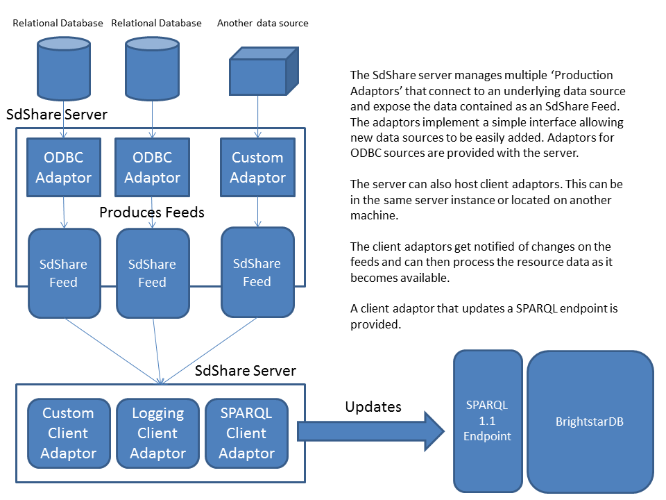

.. _SdShare_Server:

###############
 SdShare Server
###############

.. _SDShare): http://sdshare.org
.. _SdShare: http://sdshare.org
.. _BrightstarDB: mailto:contact@brightstardb.com

The BrightstarDB SdShare Server is designed to be used to expose RDF data from existing data sources. The data produced can be easily consumed into a BrightstarDB instance or any SPARQL compliant data store. The server has a pluggable architecture to allow any data source to be exposed in accordance with the latest SDShare specification (`SDShare)`_, it comes with configurable components for ODBC enabled databases.

The SdShare Server provides two main features, firstly it exposes existing data sources as feeds of data that comply with the `SdShare`_ specification.Second, it runs a client service that can consume and process valid SdShare feeds. Both the producer and consumer services offer a pluggable framework to support different data sources and data destinations. In addition, a data source adaptor is provided for exposing data via any ODBC compliant database and a client component is also provided that can send updates from an SdShare feed to any SPARQL 1.1 compliant endpoint and BrightstarDB instance.

The following diagram shows the server architecture.

************************
 SdShare Server Download
************************

The SdShare Server is is not part of the core BrightstarDB package and is made available only on request. To get access to the BrightstarDB SdShare Server please email `BrightstarDB`_.

